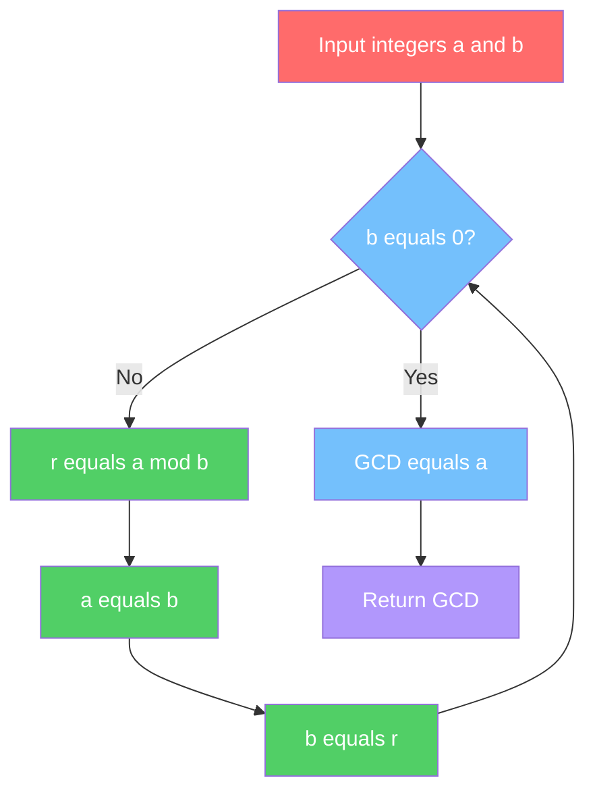
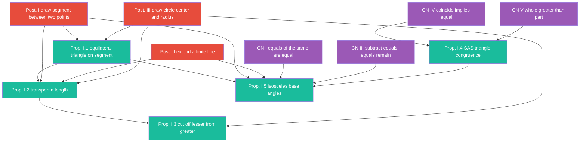
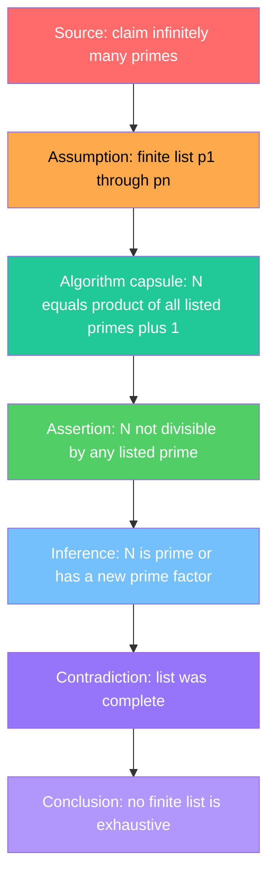
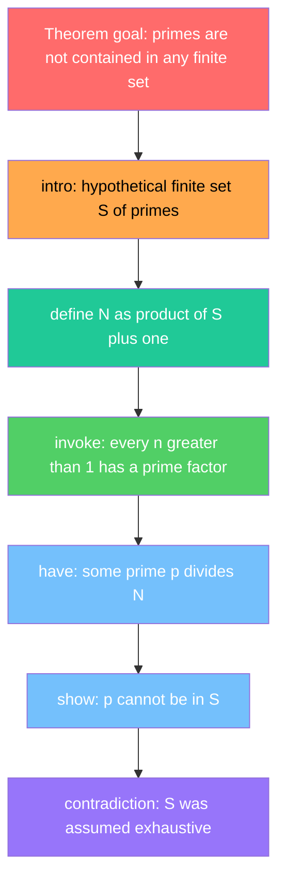
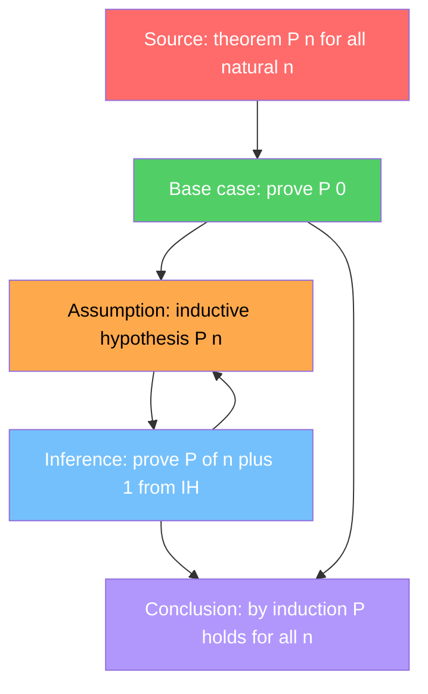
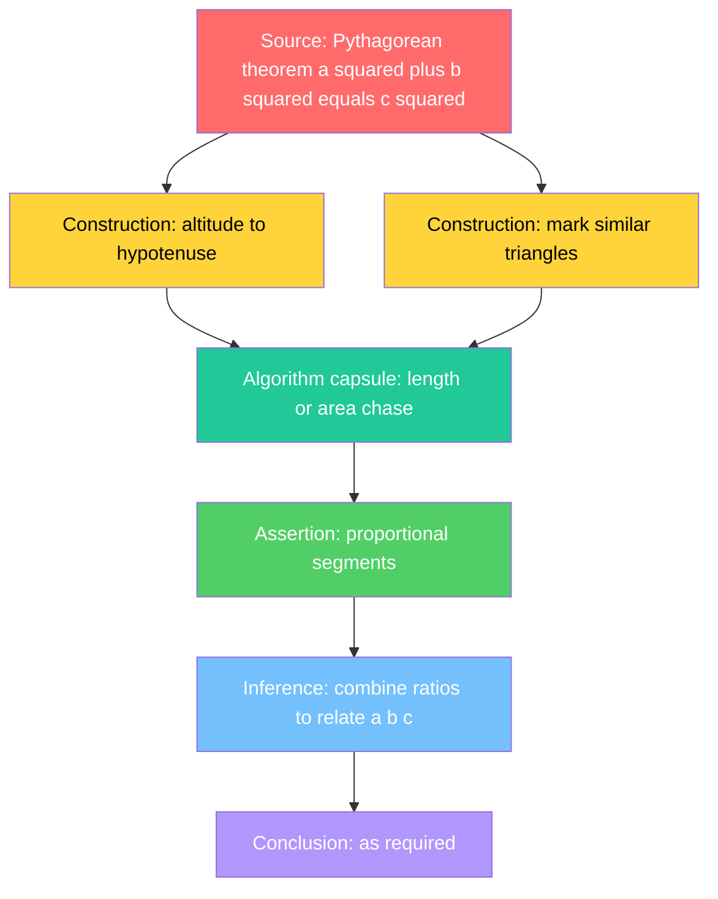
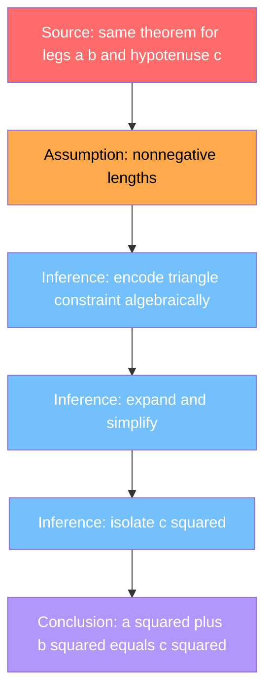

# Proof Graphs and Algorithm Capsules: A Corpus Study of Diagonalization Proofs from Cantor to Gödel to Goodstein

**Gary Welz**
Researcher, New Media Lab, CUNY Graduate Center
Email: gwelz@gc.cuny.edu
ORCID: https://orcid.org/0009-0005-7806-0892

**Status:** Declined at desk review, *Journal of Logic and Computation*, June 2026 (genre fit) | Revising for *PLOS ONE* | Preprint: Zenodo DOI 10.5281/zenodo.20510603
**Repository:** garywelz/progframe
**Path:** collaborations/mathematics-database/algorithms-axiomatic-theories-proofs-revised.md

---

## Abstract

Mathematics encompasses three fundamentally distinct object types — algorithms, axiomatic systems, and proofs. These are conventionally treated as categorically separate in mathematical practice, education, and knowledge representation. We demonstrate that all three can be expressed as labeled directed graphs using Mermaid Markdown. This unified representation reveals structural properties that conventional prose and static diagrams obscure.

The central empirical finding is the regularity of **algorithm capsules** — embedded procedural substructures within proofs — across mathematically distant domains. Analysis of the Mathematics Database corpus identifies a **diagonalization family** spanning three entries: Cantor diagonal proofs, the Gödel First Incompleteness proof graph, and the Kirby–Paris/Goodstein independence result. In each case the algorithm capsule is not incidental to the argument but is its structural core. This family resemblance is visible and measurable in the graph representation. It is not accessible from prose alone.

The representation is implemented as three graph types. Algorithmic flowcharts capture procedural structure. Axiomatic dependency graphs represent logical dependency among axioms, definitions, and theorems. Proof graphs — a hybrid form introduced here — encode justification structure using a domain-specific eight-role node vocabulary: source, assumption, construction, assertion, inference, algorithm capsule, contradiction, and conclusion. Together the three graph types constitute the Mathematics Database, a publicly accessible machine-readable corpus spanning classical geometry, number theory, algebra, set theory, mathematical logic, and theoretical computer science.

The methodology is a domain-specific application and extension of the Programming Framework, a general method for LLM-assisted process visualization. The mathematics case demonstrates that the framework's core claim extends from procedural processes to logical and justificatory structures: that formal structure is recoverable from natural language descriptions of complex systems, and is meaningful, measurable, and comparable once recovered.

**Keywords:** mathematical knowledge representation, proof graphs, axiomatic systems, LLM-generated diagrams, Mermaid, process visualization, graph-theoretic representation, Programming Framework

---

## 1. Introduction

### 1.1 The Representation Problem in Mathematical Proofs

Mathematical proofs are structured arguments in which assumptions, constructions, inferences, and conclusions carry distinct logical roles. Yet proofs are almost always published and taught in prose — linear text that conceals the dependency structure of the argument, obscures where procedural constructions sit within inferential steps, and offers no common format for comparing proofs across domains or methods.

This representational gap has consequences. A logician reading Gödel's incompleteness proof and a set theorist reading Cantor's diagonal argument may each recognize that a diagonal construction lies at the core of the argument, but comparing the structural role of those constructions — or measuring how each proof allocates complexity between procedure and inference — requires placing both arguments in a common representational space. That space does not exist in standard mathematical practice. Knowledge representation systems typically address axiomatic dependency charts or formal verification certificates, not the internal architecture of informal proof arguments as inspectable, comparable structures.

Algorithms and axiomatic systems — the other object types mathematicians work with routinely — suffer parallel representational fragmentation: procedures appear as pseudocode or flowcharts, theories as numbered axiom lists. This paper concentrates on proofs. The question is whether proof structure can be made explicit, measurable, and comparable — and whether doing so reveals regularities invisible in prose.

### 1.2 The Proposed Approach

This paper concentrates on **proof graphs** — labeled directed graphs that encode the justification structure of mathematical arguments — though the same pipeline also produces algorithmic flowcharts and axiomatic dependency graphs for comparative context (§3.1–§3.2, §6.2). The central empirical thread is a corpus study of eight proof graphs, with particular attention to three landmark diagonalization arguments: Cantor's diagonal proofs, Gödel's First Incompleteness Theorem, and the Kirby–Paris/Goodstein independence result. Represented as proof graphs, these three proofs — usually treated as belonging to set theory, mathematical logic, and combinatorics respectively — share a common structural signature: in each case an **algorithm capsule** (an embedded procedural substructure) is not incidental to the argument but is its structural core. We term this group the **diagonalization family**; the finding is developed with exact corpus figures in §6.

Proof graphs expose the roles played by different proof steps, the presence of algorithm capsules, and the structural differences between proofs of the same theorem by different methods. Algorithmic flowcharts and axiomatic dependency graphs, generated by the same methodology, provide the comparative baseline against which proof-graph complexity can be measured.

A skeptical reader might ask whether the graph representation merely redescribes what a careful reader of the prose already knows, rather than revealing anything genuinely new. The answer is that making structure explicit is itself a form of discovery — specifically when the structure was previously inaccessible to measurement and comparison. Comparing the construction in Euclid's infinitude argument to the diagonal constructions in Cantor, Gödel, and Goodstein requires a common representational space. The graph provides that space. It is what makes the diagonalization family observation a finding rather than a redescription. The situation is analogous to phylogenetic trees in biology: evolutionary relationships were always present, but the tree representation made them comparable, measurable, and falsifiable in a way that prose natural history did not.

The mechanism for generating these graphs is the Programming Framework: a methodology for transforming natural language descriptions of processes into structured Mermaid Markdown diagrams using large language models (LLMs), with human-in-the-loop validation and versioned JSON storage [1].

### 1.3 Contributions

This paper contributes:

**Conceptual:** A proof-graph formalism with an eight-role node vocabulary (source, assumption, construction, assertion, inference, algorithm capsule, contradiction, conclusion) and the algorithm capsule as a representational device for embedded procedural substructures within proofs.

**Empirical:** A corpus study of eight proof graphs, with the identification of the diagonalization family spanning Cantor, Gödel, and Goodstein — three proofs whose shared topological signature is visible and measurable in the graph representation but not recoverable from prose alone. The Mathematics Database provides the open, machine-readable infrastructure for this corpus.

**Methodological:** A human-in-the-loop pipeline for generating proof graphs from natural language descriptions using LLMs, as a domain-specific extension of the Programming Framework [1].

**Theoretical:** The claim that proof graphs regularly contain algorithm capsules, making explicit a structural relationship between proof and computation that is implicit in mathematical practice but rarely formalized at the diagram level — and that this relationship intensifies in diagonalization arguments across mathematically distant domains.

---

## 2. Related Work

### 2.1 Graph-Based Proof Representation

Graph-theoretic representations of proofs have been explored in proof complexity theory [9], where proof graphs (also called proof DAGs) are used to measure the size and depth of proofs in formal systems. DAG stands for directed acyclic graph: edges flow in one direction, and no step can depend, even indirectly, on itself. DAG-like proofs have been studied as a generalization of tree-like proofs [9].

The proof graphs in this paper are DAGs at the proof level. Several corpus entries contain algorithm capsule nodes whose internal structure is cyclic — the diagonal enumeration in the Rationals Are Countable proof, for example, contains an explicit loop. The algorithm capsule node type makes this two-level structure visible: cycles are encapsulated within capsule nodes rather than appearing at the proof graph's top level.

The present work differs from proof complexity in that it is concerned with the semantic roles of nodes in proofs — what each step does (assumption, construction, inference, and so on) — rather than with formal complexity bounds. Argument mapping [10] is a closer conceptual relative: the proof graph vocabulary in §3.3 can be understood as a domain-specific formalization of argument mapping applied to mathematical justification.

Formal proof assistants — Lean [3], Coq [5], Isabelle [6] — represent mathematics for machine verification rather than structural inspection. Section 4.1 contrasts Lean-style proof flow with the informal proof graphs used here; the two approaches are complementary, not competing.

### 2.2 LLM Diagram Generation

Large language models have demonstrated capacity for mathematical reasoning [11, 12], and recent work has explored LLM-assisted formalization of mathematics [13]. The present work uses LLMs differently: not to reason about mathematics or verify proofs, but to generate structured diagrammatic representations from natural language descriptions, as one step in a human-in-the-loop pipeline. This paper makes no claims about LLM mathematical reasoning ability, only about LLM utility as a diagram generation tool under human supervision.

### 2.3 Programming Framework and Generation Pipeline

The Programming Framework [1] is a general methodology for transforming textual process descriptions into structured Mermaid Markdown diagrams [14] using LLMs, with human-in-the-loop validation and versioned JSON storage. The present paper extends it to proof graphs by introducing the eight-role node vocabulary and algorithm capsule concept described in §3.3.

All proof graphs in the corpus were generated using the following pipeline:

**Step 1 — Source selection.** A proof is selected and a natural language description is prepared from standard reference sources — typically textbook or encyclopaedia prose.

**Step 2 — LLM prompting.** The description is submitted to a large language model with a structured prompt specifying the proof-graph node vocabulary, color scheme, and Mermaid syntax requirements.

**Step 3 — Human review.** The generated diagram is rendered and reviewed for logical dependency accuracy, node coverage, role assignment, and Mermaid validity.

**Step 4 — Metadata construction.** A JSON metadata record is constructed per the schema in §5.1; structural metrics are counted from the rendered diagram.

**Step 5 — Versioned storage.** The completed entry is committed to the Google Cloud Storage repository and made publicly accessible via the interactive viewer in §5.4.

The human review step is the primary quality control mechanism. It does not constitute formal expert validation — that limitation is noted in §7 — but it ensures that each entry has been inspected for logical accuracy by an author with familiarity with the relevant mathematical content.

---

## 3. The Three Graph Types

### 3.1 Algorithmic Flowcharts

An algorithmic flowchart in the Mathematics Database is a standard directed graph where:

- **Nodes** represent computational steps, decisions, or states
- **Edges** represent sequential or conditional flow
- **Node colors** follow the Programming Framework's five-category system: Red (inputs), Yellow (data structures/algorithms), Green (operations), Blue (intermediate states/decisions), Violet (outputs/results)
- **AND gates** represent steps that require multiple prior conditions to be satisfied before proceeding
- **OR gates** (decision nodes) represent conditional branches where one of several paths is taken
- **Loops** (back-edges) represent iterative or recursive structure

**Structural metrics captured:** node count, edge count, conditional count, AND gate count, OR gate count, loop count, graph type.

**Examples in the database:**
- Sieve of Eratosthenes — high loop depth, iterative primality marking
- Merge Sort — recursive structure, divide-and-conquer branching
- Dijkstra's Algorithm — priority queue management, relaxation loop
- Euclidean Algorithm — minimal loop, elegant termination condition
- Binary Search — logarithmic branching structure

Figure 1 illustrates the Euclidean Algorithm as an algorithmic flowchart using this color vocabulary. The algorithm is a clean example of iterative structure: a single decision node, a back-edge forming the loop, and a minimal path to termination. The color legend appears with the diagram.

*Figure 1: Euclidean Algorithm — algorithmic flowchart. Color legend: Red = input, Blue = decision/intermediate, Green = operation, Violet = output.*



Algorithmic flowcharts are the most direct application of the Programming Framework's base methodology and require no extension to the standard vocabulary.

### 3.2 Axiomatic Dependency Graphs

An axiomatic dependency graph represents the logical architecture of a mathematical system as a directed acyclic graph (DAG) — the same structure defined in §2.1, where edges flow in one direction and no theorem can depend, even indirectly, on itself. In the axiomatic context, acyclicity is not merely a formal property but a logical requirement: if theorem B depends on theorem A, then A cannot simultaneously depend on B, or the entire deductive structure would be circular and the system would prove nothing.

The nodes and edges of an axiomatic dependency graph are:

- **Nodes** represent mathematical objects: Axiom, Definition, Lemma, Theorem, Corollary, Postulate, Primitive (undefined term)
- **Edges** represent logical dependency: an edge from A to B means B depends on, uses, or requires A
- **Node colors** encode object type: a domain-specific extension of the Programming Framework's color system applied to logical roles rather than process stages
- **Depth from axioms** measures how many inference steps separate a theorem from first principles

**Structural metrics captured:** node count, edge count, depth distribution, axiom-to-theorem ratio, number of distinct proof paths to key results.

**Examples in the database:** Euclid's Elements, Peano Arithmetic, ZFC Set Theory, and standard algebraic theories — 194 entries in total, listed in the live database (§5.4). This paper does not survey them entry by entry; they supply comparative context in §6.2.

Figure 2 gives an illustrative dependency slice of Book I of Euclid's Elements — postulates, common notions, and early propositions — with coloring by object type. Node labels are abbreviated after Heath's translation.

*Figure 2: Euclid's Elements Book I — axiomatic dependency graph (illustrative; abbreviated node labels after Heath). Color legend: Red = Postulates, Purple = Common Notions, Teal = Propositions.*



Axiomatic dependency graphs require a domain-specific node vocabulary not present in the base Programming Framework, making them a natural extension case. The acyclicity of these graphs is not imposed as a technical constraint but follows from the logical requirement that deductive systems be non-circular.

### 3.3 Proof Graphs

Proof graphs are the novel contribution of this paper. A proof graph represents the justification structure of a mathematical proof as a directed graph where:

- **Nodes** carry an eight-role vocabulary encoding the proof-theoretic function of each step
- **Edges** represent logical dependency: an edge from A to B means B follows from, depends on, or uses A
- **Node colors** encode proof role, not process stage — a domain-specific extension of the Programming Framework's color system

**Proof graphs and acyclicity.** At the proof level, proof graphs are DAGs: logical dependency flows in one direction from premises to conclusion, and no step can depend, even indirectly, on itself. However, proof graphs differ from axiomatic dependency graphs in one important structural respect: they may contain algorithm capsule nodes whose internal structure is cyclic. The diagonal enumeration in the Rationals Are Countable proof contains an explicit loop; the anti-diagonal constructions in the Reals Are Uncountable and Cantor Power Set proofs encapsulate iterative procedures. The algorithm capsule node type is the representational device that makes this two-level structure visible and precise: cycles are encapsulated within capsule nodes rather than appearing at the proof graph's top level. This distinction — between proof-level acyclicity and capsule-level iteration — is one of the structural properties the unified representation makes explicit that prose cannot.

**The eight-role proof graph vocabulary:**

| Role | Color | Definition |
|------|-------|------------|
| Source | Red | The theorem, proposition, or claim being proved |
| Assumption | Orange | A temporary assumption (e.g., for contradiction or induction) |
| Construction | Yellow | An object explicitly constructed in the proof |
| Assertion | Green | A claim that follows from prior steps |
| Inference | Blue | A logical inference rule or proof step |
| Algorithm Capsule | Teal | An embedded algorithmic substructure within the proof |
| Contradiction | Purple | A contradiction reached (in proof by contradiction) |
| Conclusion | Violet | The final conclusion establishing the theorem |

**On the mutual exclusivity of roles.** The eight roles are intended to be mutually exclusive: each node in a proof graph carries exactly one role. In practice, some proof steps are ambiguous — a step may function simultaneously as a construction and an assertion, or as an inference and a conclusion. The decision rule applied in the Mathematics Database is to assign the role that best captures the step's primary proof-theoretic function. A step that constructs an object and asserts a property of it in the same move is classified as a Construction if the object's existence is what the proof requires, and as an Assertion if the property is what the proof requires. A step that draws a final inference is classified as a Conclusion rather than an Inference if it directly establishes the theorem being proved. These decisions are recorded in the entry metadata and are available for review. The goal is consistency within the corpus rather than a claim that the boundaries are always sharp.

**The algorithm capsule concept.** An algorithm capsule is a node representing an embedded procedural substructure within a proof — an explicit construction or procedure that is carried out within the proof argument and is distinct in character from the logical inference steps surrounding it. Algorithm capsules are the most structurally significant node type in the proof graph vocabulary for two reasons.

First, they mark the boundary between the algorithmic and the inferential within a single proof. In Euclid's proof of the infinitude of primes, the construction of N = p₁p₂...pₙ + 1 is an algorithm capsule: it is a finite procedure whose output — a number not divisible by any listed prime — is what the proof's contradiction depends on. The inferential steps before and after the capsule are logically dependent on the capsule's output but are not themselves algorithmic. Making this boundary explicit as a node type reveals a structural relationship between proof and computation that is normally invisible in prose.

Second, as noted above, algorithm capsules are the location within proof graphs where cyclic structure — iterative or recursive procedures — appears. The proof graph remains a DAG at its top level; the cycles are contained within capsule nodes. This encapsulation is not a limitation of the representation but a feature: it preserves the DAG structure of the proof's logical dependency while accurately representing the computational structure of its embedded procedures.

**Examples in the database:**

*Euclid Book I Pilot Proofs* (41 nodes, 48 edges, hybrid graph type) — the foundational geometric proofs; rich in construction nodes; one algorithm capsule in I.1 (compass-and-straightedge construction).

*Infinitely Many Primes* (14 nodes, 17 edges, contradiction structure) — Euclid's proof; compact graph with clear contradiction arc and a central algorithm capsule (construction of N = p₁p₂...pₙ + 1).

*Pythagorean Theorem Proof Comparison* (33 nodes, 39 edges, multiple proof families) — graph representation of multiple distinct proofs of the same theorem; structural differences between proof families become visually and metrically comparable.

*Fundamental Theorem of Arithmetic* (27 nodes, 34 edges) — the unique prime factorization theorem; graph reveals the two-part structure (existence and uniqueness) and their distinct dependency chains.

*Cantor Diagonal Proofs* (42 nodes, 50 edges, hybrid family) — Cantor's diagonal argument in multiple variants; algorithm capsule is the structural core of all variants; graph reveals the family resemblance across proof variants and the two-level DAG/cycle structure described above.

*Gödel Completeness Theorem* (15 nodes, 15 edges) — proof graph pilot; dependency structure of the completeness argument; one algorithm capsule.

*Gödel First Incompleteness Theorem* (14 nodes, 13 edges) — proof graph pilot; the diagonal lemma appears as an algorithm capsule, making this the first algorithm/proof pair in the corpus where the same mathematical content appears in both the algorithm and proof graph categories.

*Kirby–Paris/Goodstein Independence Result* (10 nodes, 9 edges) — frontier entry; two-level proof structure flagged for additional validation.

The three graph types differ not only in their node vocabularies but in the characteristic shapes they produce — topological signatures that are the subject of §4.

---

## 4. Structural Properties of the Three Graph Types

The three graph types introduced in §3 are distinguished not only by their node vocabularies but by their topological signatures — the characteristic shapes that different mathematical structures produce when rendered as directed graphs. This section develops four such signatures: the contrast between informal proof graphs and formal proof assistant representations (§4.1), the role of loops and back-edges in proof and algorithm graphs (§4.2), the contrast between merge and chain topologies in proof graphs (§4.3), and the AND/OR conjunctive structure of proof premises (§4.4).

### 4.1 Informal Proof Graphs and Lean-Style Proof Structure

Proof assistants such as Lean 4 [3] and its mathlib library [4] encode proofs as terms in dependent type theory. The interactive experience is a sequence of goals refined by tactics (`intro`, `have`, `rw`, `exact`, `contradiction`, and others). Mathlib and related libraries supply lemmas as certified building blocks. None of that is what the proof graphs in this paper are trying to duplicate: our graphs are pedagogical and structural — eight semantic roles applied to natural language arguments — not machine-checked certificates.

Still, it is useful to place the two representations side by side on the same mathematical idea: Euclid's argument that no finite list of primes is exhaustive. The informal proof graph emphasizes roles (source, assumption, algorithm capsule, contradiction, and so on). A schematic Lean-shaped graph emphasizes proof obligations and lemma dependencies as one might sketch after reading a formal proof. The labels below are illustrative, not a literal port of a specific Mathlib proof term.

**Informal proof graph (role-oriented).**



**Lean-schematic proof tree (goal and lemma oriented).**



**How the two differ:**

| Dimension | Informal proof graph (this paper) | Lean-style schematic |
|-----------|-------------------------------------|----------------------|
| **Node meaning** | Epistemic role (assumption, construction, …) | Goal state, definition, or lemma application |
| **Edges** | Justifies or explains for a human reader | Resolves subgoal or depends on lemma in library |
| **Correctness** | Human review; not machine-checked | Kernel-checkable when fully formalized |
| **Granularity** | Chosen for clarity; steps may be coarse | Often fine-grained, many small tactic steps |
| **Construction** | LLM from prose, reviewed by author | Tactics or proof terms |
| **Algorithm capsule** | Explicit node type for procedural content | Corresponds to computable definitions inside terms |

**Takeaway.** Lean proofs and informal proof graphs are complementary: Lean answers "is this formally correct?"; proof graphs answer "how is the argument organized for inspection, teaching, and cross-proof comparison?" A natural research direction — noted in §8 — is to map or align Lean proof terms or tactic traces to role-labeled graphs so the same theorem can be viewed in both registers. That pipeline does not exist in the current Mathematics Database corpus, which remains informal and LLM-derived.

### 4.2 Loops, Back-Edges, and Iterative Structure

Algorithmic flowcharts may contain genuine cycles — back-edges that represent iteration or recursion. Proof graphs, as argued in §3.3, are DAGs at the proof level but may contain cycles encapsulated within algorithm capsule nodes.

One proof structure that appears to require a cycle at the proof level is mathematical induction. In prose, induction "reapplies the same step" at ever-larger indices, which suggests a loop. In the graph representation, however, induction is better rendered as a back-edge from the inductive step node to the inductive hypothesis node — semantically the same "next instance of the pattern," but a DAG with one back-edge that displays reliably in Mermaid and preserves the directional dependency structure.



The back-edge from ST to IH encodes the inductive pattern without introducing a full cycle into the proof graph. This is a principled representational choice: the back-edge marks where the inductive pattern repeats without implying that the proof's logical dependency is circular.

This treatment of induction illustrates a general design principle for proof graphs: **represent iterative proof patterns as back-edges rather than self-loops**, both for Mermaid rendering reliability and for logical clarity. Self-loops in Mermaid are rendered inconsistently across versions; back-edges to a prior node are reliable and semantically equivalent for the purposes of the proof graph representation.

### 4.3 Merge and Chain Topologies

Different proof strategies for the same theorem produce characteristically different graph topologies. The Pythagorean Theorem proof comparison entry in the Mathematics Database illustrates this most clearly.

A geometric proof — such as the similar-triangle construction — fans out into multiple construction nodes before converging on a central algorithm capsule, producing a **merge topology**: width followed by a join.



An algebraic proof — proceeding by symbolic rewriting — produces a **chain topology**: a narrow sequential path of inference nodes with few constructions and shallow branching.



| Topology | Visual signature | Typical role mix |
|----------|-----------------|------------------|
| Merge (geometric) | Width then join into capsule | Several Construction and Algorithm capsule nodes |
| Chain (algebraic) | Serial inferences, shallow branching | Predominantly Inference, few constructions |
| Contradiction hub | Dense assumption/inference subgraph feeding single contradiction node | High Assumption and Inference count, minimal conclusion arc |
| Back-edge (induction) | Loop from inductive step to hypothesis | One Assumption node, repeated inferential pattern |

These topological signatures are visible by inspection and measurable by the metadata fields in the Mathematics Database schema. They constitute a vocabulary for describing what a proof graph looks like beyond raw node counts — and they are the basis for the cross-proof-family comparisons developed in §6.3.

### 4.4 Conjunctive Premises and AND Structure

A structural distinction important in proof graphs but not in algorithmic flowcharts is the difference between **alternative paths** and **joint premises**. In an algorithm, multiple edges pointing to a single node typically mean that control may arrive from alternative paths — an OR structure. In a proof, multiple edges pointing to a single node typically mean that all the incoming steps are required together — a conjunctive or AND structure representing joint justification.

In the Mathematics Database as currently deployed, this distinction is carried by node labels and colors rather than by distinct graph syntax. A design iteration under evaluation introduces a compact hexagonal AND marker for conjunctive joins, making joint justification explicitly visible in the graph without requiring a large decorative node. The working principle is to reserve AND markers for semantically important conjunctions — cases where the joint requirement of multiple premises is itself a proof-theoretic observation worth marking — rather than applying them uniformly to every node with multiple predecessors.

This design question — how to represent conjunctive premise structure without visual noise — is an open one for the proof graph representation and is noted here as a known limitation and active development direction.

---

## 5. The Mathematics Database

The three graph types and their topological properties described in §3 and §4 are implemented in the Mathematics Database — a publicly accessible corpus of LLM-generated graphs stored as versioned JSON metadata and rendered through an interactive HTML viewer.

### 5.1 Architecture

The Mathematics Database is implemented as a collection of JSON metadata files stored on Google Cloud Storage, with an interactive HTML viewer that renders the data in three sortable tables — algorithms, axiomatic theories, and proof graphs — and generates live Mermaid diagram previews.

Each entry in the database is a JSON object. The normative schema used in this paper — expressed in JSON Schema [15] — is:

```json
{
  "id": "string",
  "title": "string",
  "category": "algorithm | axiomatic_system | proof_graph | hybrid",
  "subcategory": "string",
  "graph_type": "flowchart | dependency | proof | hybrid",
  "complexity": "low | medium | high",
  "nodes": integer,
  "edges": integer,
  "conditionals": integer,
  "and_gates": integer,
  "or_gates": integer,
  "not_gates": integer,
  "loops": integer,
  "algorithm_capsules": integer,
  "temporary_assumptions": integer,
  "mermaid": "string",
  "collections": ["string"],
  "frontier": boolean,
  "source": "string",
  "llm_version": "string",
  "version": "string"
}
```

The deployed manifest uses `name` in place of `title` and `processType` in place of `category` for implementation compatibility. All other fields are identical between the normative schema and the deployed manifest.

The analytical focus of this paper is the eight-entry **proof graph corpus** documented in §5.3. The broader Mathematics Database — produced by the same pipeline — also contains 23 algorithmic flowcharts and 194 axiomatic dependency graphs (see §5.4 for the full manifest). Those entries supply comparative context in §6.2 but are not catalogued here.

The `frontier` flag marks entries where the graph representation pushes against the limits of Mermaid's expressivity or the LLM's reliability — cases requiring additional validation or suggesting future extensions to the methodology. One proof graph entry currently carries this flag: the Kirby–Paris/Goodstein Independence result, noted in §6.1.

### 5.2 Named Collections

The database includes named collections — curatorial groupings of entries by mathematician or theorem family. Their purpose is navigational: a reader interested in Cantor's work, or Gödel's foundational results, or Euclid's geometry can locate all relevant entries together without searching by subcategory. Named collections currently cover 63 mathematicians and 32 theorem families, for a total of 95 groupings. They are a discoverability feature rather than a formal structural category and carry no analytical weight in the corpus metrics.

### 5.3 Corpus Overview

Table 1 gives exact node, edge, and algorithm capsule counts for all eight proof graph entries in the May 2026 manifest, drawn directly from the deployed metadata.

*Table 1: Proof graph corpus — exact figures from May 2026 manifest.*

| Entry | Nodes | Edges | Capsules | Temp. Assumptions | Frontier |
|-------|-------|-------|----------|-------------------|----------|
| Euclid Book I bundle | 41 | 48 | 1 | 0 | — |
| Pythagorean Theorem | 33 | 39 | 2 | 0 | — |
| Infinitely Many Primes | 14 | 17 | 1 | 1 | — |
| Fundamental Theorem of Arithmetic | 27 | 34 | 2 | 1 | — |
| Kirby–Paris / Goodstein | 10 | 9 | 1 | 0 | yes |
| Cantor Diagonal Proofs | 42 | 50 | 1 | 0 | — |
| Gödel Completeness | 15 | 15 | 1 | 0 | — |
| Gödel First Incompleteness | 14 | 13 | 1 | 0 | — |
| **Totals** | **196** | **225** | **10** | **2** | |
| **Averages** | **24.5** | **28.1** | **1.25** | **0.25** | |

All eight proof graph entries contain at least one algorithm capsule. Within the Euclid Book I bundle, only proposition I.1 contributes a capsule — I.4 and I.5 carry individual construction nodes rather than capsules — as discussed in §6.1. The average of 24.5 nodes and 28.1 edges per proof graph is roughly double the typical algorithmic flowchart in the same manifest, reflecting the higher inferential overhead of justification relative to procedure.

### 5.4 Live Database

The Mathematics Database is publicly accessible at:

https://storage.googleapis.com/regal-scholar-453620-r7-podcast-storage/mathematics-processes-database/mathematics-database-table.html

Interactive viewers for all three graph types, including live Mermaid rendering, are available at:

https://huggingface.co/spaces/garywelz/programming_framework

An experimental viewer demonstrating the compact hexagonal AND marker grammar and revised proof-role palette — discussed in §4.4 — is available for the Infinitely Many Primes proof graph at:

https://storage.googleapis.com/regal-scholar-453620-r7-podcast-storage/mathematics-processes-database/proof-graphs/infinitely-many-primes-v2-demo.html

This URL should be understood as a shape-and-palette demonstration. The main corpus tables use the rectangular default rendering until migration and validation are complete.

---

## 6. Findings from the Proof Graph Corpus

This section reports three findings from the eight-entry proof graph corpus (Table 1, §5.3): the diagonalization family spanning Cantor, Gödel, and Goodstein (§6.1), structural complexity differences between proof graphs and other graph types (§6.2), and topological differences between proof families for the same theorem (§6.3).

### 6.1 The Diagonalization Family

The central finding of this corpus study is that three landmark diagonalization proofs — Cantor's diagonal arguments, Gödel's First Incompleteness Theorem, and the Kirby–Paris/Goodstein independence result — form a structurally coherent **diagonalization family** when represented as proof graphs. In each case an **algorithm capsule** is not incidental to the proof but is its structural core — the mechanism by which the argument achieves its result.

In the Cantor diagonal proofs the capsule is the construction of a real number, subset, or enumeration path that differs from every element of an assumed listing — a finite procedure applied at each position of an infinite list. In the Gödel First Incompleteness proof graph the capsule is the diagonal lemma: the arithmetical procedure that constructs a self-referential sentence by applying a provability predicate to its own Gödel number. In the Kirby–Paris/Goodstein entry the capsule is the Goodstein sequence computation — an explicit algorithmic procedure whose termination, provable by ordinal descent, cannot be established within Peano Arithmetic.

All three capsules have the same logical role: they construct an object with a property that generates the proof's central tension, whether contradiction, unprovability, or independence. The proof graph representation makes this family resemblance visible and measurable. All three entries share a common topological signature: a dense algorithm capsule node with high out-degree feeding into an assertion chain that terminates either at a contradiction node (Cantor, Gödel) or a meta-level independence node (Kirby–Paris). This signature is not accessible from prose descriptions of the three proofs, which present them as belonging to different mathematical domains — set theory, mathematical logic, and combinatorics respectively.

The Gödel Numbering algorithm — included in the corpus as a standalone algorithmic flowchart — serves as the explicit capsule twin to the First Incompleteness proof graph, making this the first algorithm/proof pair in the corpus where the same mathematical content appears in both categories. This pairing directly supports the claim in §1.2: placing proofs and algorithms in a common representational space reveals structural relationships invisible when the two object types are represented separately.

**Scope note.** Gödel's second incompleteness theorem is represented in the current database only as an axiomatic dependency chart (Peano and Gödel sequence, Part 8). A dedicated proof graph for second incompleteness is deferred: it requires additional internal formalization of consistency statements and would exceed the validation burden of the first incompleteness pilot.

Beyond the diagonalization family, algorithm capsules appear in all eight proof graph entries (Table 1). What the proof graph representation makes explicit — and measurable — is the structural boundary between the algorithmic and the inferential within a single proof. That boundary is visible in the graph and absent from prose.

Within the Euclid Book I bundle, the fact that only proposition I.1 contributes a capsule is instructive. I.4 (SAS Congruence) has zero capsules because its proof proceeds entirely by superposition: a methodological assumption rather than a construction. I.5 (Base Angles) has zero capsules because its construction steps are individual proof-specific auxiliary lines rather than a reusable procedure. The contrast between I.1, I.4, and I.5 within the same bundle illustrates the decision rule stated in §3.3: a capsule is a self-contained procedural substructure with its own input/output logic, not merely a sequence of construction steps.

### 6.2 Structural Complexity Comparison

The database's quantitative metadata enables direct complexity comparison across mathematical objects that are not usually compared. Using the exact figures from Table 1, the eight proof graph entries average 24.5 nodes and 28.1 edges — roughly double the typical algorithmic flowchart in the same manifest. Individual proof graphs range from 10 nodes and 9 edges (Kirby–Paris/Goodstein, frontier) to 42 nodes and 50 edges (Cantor Diagonal Proofs bundle).

Three structural observations follow from the corpus metadata:

**Proof graphs are more complex than algorithmic flowcharts of comparable mathematical content.** The higher node and edge counts reflect the inferential overhead of justification relative to procedure: a proof must not only perform a computation but establish why the computation's output has the required property. The algorithm capsule node type makes this overhead visible by marking where procedure ends and inference begins.

**Proof graphs differ in complexity from axiomatic dependency graphs of related content.** Axiomatic charts in the broader database (e.g., Peano Arithmetic, ZFC) vary in depth-to-breadth ratio; proof graphs for the same domain allocate complexity differently, with higher inferential overhead reflected in node and edge counts.

**Proof-by-contradiction graphs have a distinctive topology.** A single contradiction node with high in-degree, preceded by a dense assumption and inference subgraph, followed by a minimal conclusion arc. This contradiction hub topology is visible in the Cantor, Gödel, and Infinitely Many Primes entries and is one of the topological signatures identified in §4.3.

These observations are grounded in exact figures from a small, manifest-documented corpus of eight proof graphs. They should be understood as findings from a systematic pilot rather than large-scale statistical claims. A larger corpus — developed through the community extension process described in §8 — would support stronger statistical inference.

### 6.3 Cross-Proof-Family Comparison

The Pythagorean Theorem proof comparison entry demonstrates a capability unique to the graph-theoretic approach: direct structural comparison of multiple proofs of the same theorem. The entry captures several distinct proof families — geometric, algebraic, and trigonometric — in a single hybrid graph, with node colors encoding proof family membership.

The topological contrast between proof families, developed in §4.3, becomes metrically grounded here. Geometric proofs allocate complexity differently from algebraic proofs: more construction nodes and algorithm capsules in the geometric family, longer inference chains and fewer constructions in the algebraic family, more assumption nodes in the trigonometric family (which requires more lemmas about trigonometric identities as starting points).

These differences are difficult to articulate precisely in prose. In the graph representation they are visible by inspection and measurable from the metadata. A proof with two construction nodes and two capsules feeding a single algorithm capsule hub has a different structural character from a proof with five sequential inference nodes and no capsules — and that difference is now expressible as a metric rather than a qualitative judgment.

The Pythagorean Theorem entry is the proof graph corpus's clearest demonstration that the representation enables a new kind of mathematical comparison: not "which proof is more elegant" — a judgment that depends on aesthetic criteria — but "which proof allocates its structural complexity differently, and in what specific ways." That is a question the graph representation can answer precisely.

---

## 7. Limitations

**LLM accuracy.** LLM-generated proof graphs may misrepresent the logical structure of proofs, particularly for complex or non-standard arguments. All entries in the current database have been reviewed by the author, but systematic expert validation — particularly by logicians and proof theorists — remains future work. The human-in-the-loop pipeline described in §2.3 mitigates but does not eliminate this risk.

**Mermaid expressivity.** Mermaid does not natively support some features that would be useful for proof graphs: parallel proof branches, multiple inheritance in axiomatic hierarchies, or quantifier structure. The most consequential expressivity limitation is the representation of conjunctive premises — distinguishing joint justification from alternative control flow paths. The AND marker grammar described in §4.4 addresses this partially; it remains under evaluation and has not yet been rolled out across the main corpus. These limitations are otherwise managed by approximation and noted in individual entry metadata.

**The DAG assumption and encapsulated cycles.** Proof graphs in this corpus are treated as DAGs at the proof level, with cycles encapsulated within algorithm capsule nodes. This is a principled representational choice, as argued in §3.3, but it means that the internal structure of capsule nodes is not fully represented in the top-level graph. A proof graph representation that exposed capsule-internal structure as a subgraph would be more expressive but significantly more complex to generate, validate, and render. This is a known limitation of the current implementation.

**Corpus size.** The proof graph corpus contains eight entries across five mathematical domains. The findings in §6 are grounded in exact figures from this corpus but should be understood as findings from a systematic pilot rather than large-scale statistical claims. The observations about the diagonalization family, contradiction hub topology, and cross-proof-family complexity differences are structurally well-motivated but would benefit from a larger corpus for statistical confirmation.

**No formal semantics.** The graph representations are visually and structurally informative but do not carry formal logical semantics. They are not machine-verifiable in the sense of proof assistants. They are human-readable and machine-processable structural descriptions — a complement to formal verification systems rather than a substitute for them. The relationship to formal proof assistants is discussed in §4.1.

**Single author, single pipeline.** All current entries were generated and reviewed by a single author using a single LLM pipeline. Inter-rater reliability and multi-pipeline reproducibility have not been evaluated. This is a standard limitation of first-generation corpus construction and is noted here for transparency.

---

## 8. Future Directions

**Capsule-internal structure as subgraphs.** The current implementation encapsulates cyclic and iterative structures within algorithm capsule nodes, preserving DAG structure at the proof level. A natural extension is to expose capsule-internal structure as explicit subgraphs — rendering the diagonal enumeration in the Cantor proofs or the Goodstein sequence computation in the Kirby–Paris entry as fully expanded flowcharts linked to their parent proof graphs. This would make the two-level DAG/cycle structure described in §3.3 and §7 fully visible and navigable rather than implied by the capsule node type. The technical challenge is rendering complexity: subgraph expansion would significantly increase diagram size and may require a viewer interface that supports expand/collapse navigation rather than static Mermaid rendering.

**Integration with proof assistants.** The Lean 4 mathematical library (Mathlib) and the Coq Proof Assistant contain large bodies of formalized mathematics. As sketched in §4.1, informal proof graphs and Lean-style proof structures are complementary rather than competing representations: Lean answers "is this formally correct?" while proof graphs answer "how is the argument organized for inspection and comparison?" A natural research direction is to align the two — mining tactic traces or proof terms from Lean into role-labeled graphs, or using Mathlib entries as ground truth for validating corpus entries. This pipeline does not exist in the current database but would significantly increase both corpus size and validation quality.

**Systematic corpus validation and metadata quality.** The manifest correction identified during preparation of this paper — the Euclid Book I bundle capsule count requiring update from 0 to 1 — points to a broader need for systematic metadata validation across the corpus. A validation pipeline that checks field consistency, flags zero-capsule proof graph entries for review, and cross-checks node and edge counts against rendered diagrams would improve corpus quality and reproducibility. This is particularly important before community extension, where submitted entries will not have been generated by the same author using the same pipeline.

**Community extension.** A community-driven submission and review process, modeled on arXiv or Zenodo, would enable other researchers to contribute entries, validate existing ones, and propose new named collections. The Mathematics Database's current single-author, single-pipeline construction is appropriate for a pilot corpus but limits scale and reproducibility. Community extension would require the validation pipeline described above as a prerequisite.

**Cross-domain comparison across the Programming Framework.** The Programming Framework has been applied across biology, chemistry, physics, computer science, and mathematics. The most ambitious extension of the present work is systematic comparison across the discipline-specific databases — identifying structural regularities that appear across domains and asking whether the algorithm capsule concept, the contradiction hub topology, or the DAG/cycle two-level structure have analogs in non-mathematical process graphs. This is the subject of a planned comparative paper.

**AI-assisted mathematics education.** The Mathematics Database's interactive viewers suggest a natural application in mathematics education. Students can explore the dependency structure of theorems, trace proof paths from axioms, and compare the structural complexity of different proofs of the same result. The named collections — grouping entries by mathematician or theorem family — provide entry points organized around the historical narrative of mathematics rather than formal subcategory. Development of educational interfaces tailored to undergraduate and graduate mathematics curricula is planned.

**Proof-graph shape grammar.** The topological signatures identified in §4.3 — contradiction hub, merge, chain, back-edge — constitute the beginning of a shape grammar for proof graphs. Extending this grammar systematically across the full corpus, testing whether the signatures scale to more complex proofs such as the Cantor diagonal family or the Fundamental Theorem of Arithmetic, and developing a formal vocabulary for describing proof graph topology beyond raw node counts is a natural next step. The AND marker grammar described in §4.4 is one component of this; a complementary OR/case-split marker for genuine alternative proof branches is a natural addition, to be used with the same discipline of reserving markers for semantically important structural features.

---

## 9. Conclusion

This paper has introduced proof graphs with algorithm capsules as a diagrammatic representation of mathematical justification structure, and reported a corpus study of eight proof graphs with a central finding: three landmark diagonalization proofs — Cantor, Gödel, and Goodstein — form a structurally coherent family whose common topological signature is only visible in the graph representation. In each case the algorithm capsule is not incidental to the proof but is its structural core. This family resemblance cuts across the conventional domain boundaries of set theory, mathematical logic, and combinatorics. It is a finding about mathematical structure, not merely about representation.

All eight proof graph entries in the corpus contain at least one algorithm capsule; the diagonalization family is the most structurally pronounced instance of a broader regularity.

A skeptic might ask whether the graph representation merely redescribes what a careful reader of the prose already knows. The answer developed in §1.2 bears restating here: making structure explicit is itself a form of discovery when the structure was previously inaccessible to measurement and comparison. The diagonalization family is not visible in prose descriptions of the three proofs. It becomes visible — and measurable, and comparable — only when the three proofs are placed in a common representational space. The same is true of the two-level DAG/cycle structure identified in §3.3: proof graphs are acyclic at the proof level but may contain cycles encapsulated within algorithm capsule nodes. That structural property is present in the proofs whether or not it is represented. The graph makes it nameable, inspectable, and available for cross-proof comparison in a way that prose does not.

The proof graph node vocabulary — eight roles encoding the proof-theoretic function of each step — and the algorithm capsule concept are contributions to the general Programming Framework vocabulary with applications beyond mathematics. Wherever embedded procedural substructures appear within larger logical or justificatory structures, the algorithm capsule node type provides a representational handle that makes those substructures visible, nameable, and comparable.

The Mathematics Database is offered as open infrastructure: a starting point that others can validate, extend, and critique. Its current scale — eight proof graphs, 194 axiomatic dependency graphs, 23 algorithmic flowcharts — is appropriate for a pilot corpus. The findings it supports are structurally well-motivated and grounded in exact public figures. A larger corpus, developed through the community extension and validation processes described in §8, would support stronger claims.

The broader argument of this paper is that formal structure is recoverable from natural language descriptions of complex systems, and is meaningful, measurable, and comparable once recovered. That argument was first made for procedural processes. This paper extends it to logical dependency structures and justificatory structures. The same representational move that makes algorithms inspectable as typed computational graphs makes mathematical proofs inspectable as typed justification graphs — and in doing so reveals that some of the most important proofs in the history of mathematics share a structural core that their surface differences in domain and technique have long obscured.

---

## References

[1] G. Welz, *The Programming Framework: A General Method for Process Analysis Using LLMs and Mermaid Visualization*, Zenodo preprint, DOI: 10.5281/zenodo.18463441, 2026.

[2] "The QED manifesto," in *Automated Deduction — CADE-12*, LNCS 814, Springer, 1994, pp. 237–251.

[3] J. Avigad, L. de Moura, S. Koon, and S. Ullrich, *Theorem Proving in Lean 4*, online textbook, Lean Community, https://lean-lang.org/theorem_proving_in_lean4/ (accessed May 2026).

[4] The mathlib Community, "The Lean mathematical library," in *Certified Programs and Proofs (CPP '20)*, ACM, 2020, pp. 130–144. DOI: 10.1145/3372885.3373824

[5] The Coq Development Team, *The Coq Proof Assistant* — documentation and releases, https://coq.inria.fr/ (accessed May 2026).

[6] T. Nipkow, L. C. Paulson, and M. Wenzel, *Isabelle/HOL: A Proof Assistant for Higher-Order Logic*, LNCS 2283, Springer, 2002.

[7] A. Grabowski, A. Korniłowicz, and A. Naumowicz, "Four decades of Mizar," *Journal of Automated Reasoning*, vol. 55, no. 3, pp. 191–198, 2015.

[8] OpenMath Society, *The OpenMath Standard* (2.0 / ongoing revisions), https://www.openmath.org/ (accessed May 2026).

[9] J. Krajíček, *Bounded Arithmetic, Propositional Logic, and Complexity Theory*, Cambridge University Press, 1995.

[10] C. R. Twardy, "Argument maps improve critical thinking," *Teaching Philosophy*, vol. 27, no. 1, pp. 1–22, 2004.

[11] OpenAI, "GPT-4 technical report," *arXiv:2303.08774*, 2024.

[12] A. Lewkowycz et al., "Solving quantitative reasoning problems with language models," *Nature*, vol. 619, pp. 471–478, 2022.

[13] S. Polu and I. Sutskever, "Generative language modeling for automated theorem proving," *arXiv:2009.03393*, 2020.

[14] K. Sveidqvist and contributors, *Mermaid* — diagram syntax and toolkit, https://www.mermaidjs.org/ (accessed May 2026).

[15] JSON Schema Consortium, *JSON Schema: A Media Type for Describing JSON Documents*, Draft 2020-12 and specifications, https://json-schema.org/ (accessed May 2026).

---

## Acknowledgments

This work is part of the CopernicusAI Knowledge Engine project, which aims to create AI-powered tools for scientific research synthesis and knowledge discovery. The Mathematics Database and the Programming Framework serve as foundational methodological components of that project. The author thanks the CUNY Graduate Center New Media Lab for institutional support.

The diagrams in this paper were generated with large-language-model assistance as part of the Programming Framework methodology described herein; large-language-model tools were also used to assist with copy-editing and revision. All scholarly content, analysis, and conclusions are the author's own.

---

## Appendix: Reference Proof Graph — Infinitely Many Primes (Euclid)

The following proof graph illustrates per-node role styling for the eight-role schema from §3.3 on Euclid's infinitude-of-primes argument. Node colors map to roles: Red = source, Orange = assumption, Teal = algorithm capsule, Green = assertion, Blue = inference, Purple = contradiction, Violet = conclusion. The Construction role (Yellow) has no standalone node in this compact presentation — the Euclidean construction is represented inside the algorithm capsule.


