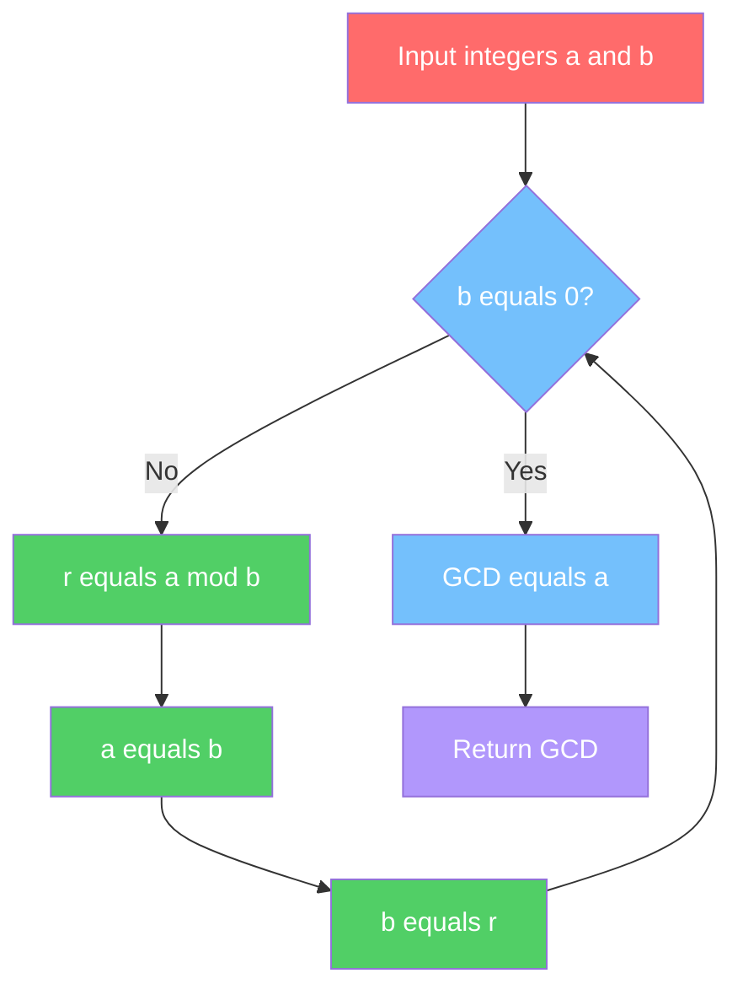
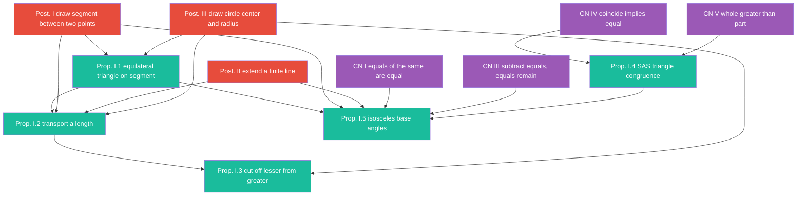
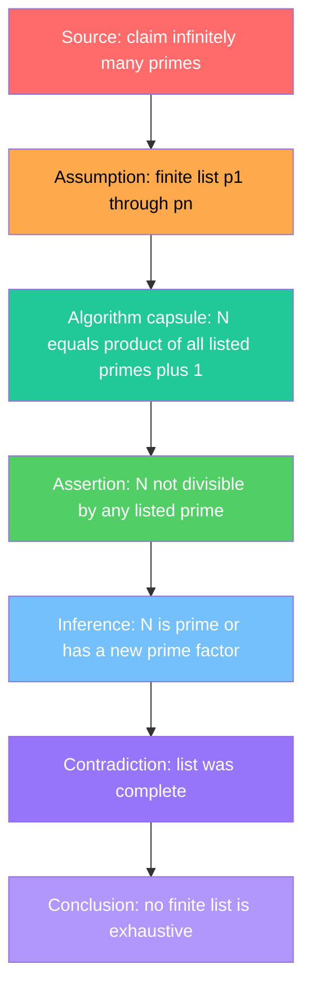

# Algorithms, Axioms, and Proofs as Graphs: A Unified Diagrammatic Representation of Mathematical Structure

**Gary Welz**  
Independent Researcher  
Affiliate, New Media Lab, CUNY Graduate Center  
Creator, CopernicusAI Knowledge Engine  
Email: gwelz@gc.cuny.edu

**Status:** Pre-submission draft — May 2026  
**Repository:** garywelz/progframe  
**Path:** collaborations/mathematics-database/mathematics-paper-draft.md  
**Target venue:** *Journal of Logic and Computation* (Oxford) — primary;  
*PLOS ONE* — secondary (dataset/methods framing)

---

## Abstract

Mathematics encompasses three fundamentally distinct object types —
algorithms, axiomatic systems, and proofs — that are conventionally treated
as categorically separate in mathematical practice, education, and knowledge
representation. We propose and demonstrate a unified diagrammatic
representation in which all three are expressed as labeled directed graphs
using Mermaid Markdown, generated by large language models (LLMs) and stored
as versioned JSON metadata. Algorithmic flowcharts capture procedural
structure via sequential steps, conditional branches, and feedback loops.
Axiomatic dependency graphs represent logical dependency among axioms,
definitions, lemmas, theorems, and corollaries. Proof graphs — a hybrid
form introduced here — encode justification structure using a domain-specific
eight-role node vocabulary (source, assumption, construction, assertion,
inference, algorithm capsule, contradiction, conclusion) that makes embedded
algorithmic substructures within proofs explicitly visible. Together these
three graph types constitute the Mathematics Database, a publicly accessible,
machine-readable corpus spanning classical geometry, number theory, algebra,
set theory, and theoretical computer science. We argue that this unified
representation reveals structural properties — including complexity metrics,
algorithm capsule frequency, and cross-proof-family comparisons — that are
obscured by conventional prose and static diagrams. The methodology is a
domain-specific application of the Programming Framework, a general method
for LLM-assisted process visualization across scientific disciplines, and
makes a parallel argument to the Genome Logic Modeling Project's treatment
of gene regulatory circuits: that formal structure is recoverable from
natural language descriptions of complex systems and is meaningful,
measurable, and comparable once recovered.

**Keywords:** mathematical knowledge representation, proof graphs, axiomatic
systems, LLM-generated diagrams, Mermaid, process visualization, graph-theoretic
representation, Programming Framework

---

## 1. Introduction

### 1.1 The Representation Problem in Mathematics

Mathematics is unusual among scientific disciplines in having multiple
fundamentally different kinds of objects that practitioners work with
routinely. An algorithm is a procedure: a finite sequence of steps that
transforms an input into an output. An axiomatic system is a dependency
structure: a network of definitions and deductions where theorems follow
from axioms through chains of logical inference. A proof is a justification:
a structured argument that a particular claim follows necessarily from
accepted premises, often involving constructions, assumptions, and
contradiction.

These three object types are taught differently, published differently, and
represented differently. Algorithms appear as pseudocode or flowcharts.
Axiomatic systems are presented as numbered lists of postulates followed by
theorems in linear sequence. Proofs are written in prose, sometimes with
diagrams, rarely with any formal representation of their logical dependency
structure.

This representational fragmentation has consequences. It makes cross-object
comparison difficult: how does the structural complexity of a proof compare
to the algorithm it may implicitly contain? It makes machine processing
difficult: knowledge representation systems for mathematics typically handle
one object type at a time. And it obscures structural regularities that are
visible only when the objects are placed in a common representational space.

### 1.2 The Proposed Approach

We propose that algorithms, axiomatic systems, and proofs can all be
represented as labeled directed graphs, and that this unification is not
merely a formal exercise but reveals genuine structural properties of
mathematical objects. Specifically:

- **Algorithmic flowcharts** expose the computational structure of procedures:
  their branching factor, loop depth, and sequential complexity.
- **Axiomatic dependency graphs** expose the logical architecture of
  mathematical systems: which theorems depend on which axioms, and how
  far removed from first principles any given result is.
- **Proof graphs** expose the justification structure of mathematical
  arguments: the roles played by different steps, the presence of embedded
  algorithmic substructures (algorithm capsules), and the structural
  differences between proofs of the same theorem by different methods.

The mechanism for generating these graphs is the Programming Framework: a
methodology for transforming natural language descriptions of processes into
structured Mermaid Markdown diagrams using LLMs, with human-in-the-loop
validation and versioned JSON storage [CITE: Programming Framework paper].

### 1.3 Contributions

This paper contributes:

**Conceptual:** A unified graph-theoretic representation of three
mathematically distinct object types, with a formal characterization of
each graph type and the node/edge vocabularies that distinguish them.

**Empirical:** The Mathematics Database — a publicly accessible corpus of
LLM-generated graphs spanning algorithms (Sieve of Eratosthenes, Merge Sort,
Dijkstra's Algorithm, Euclidean Algorithm, and others), axiomatic systems
(Euclid's Elements, Peano Arithmetic, ZFC Set Theory, Group Theory, Ring
Theory, Field Theory, Category Theory, Lambda Calculus), and proof graphs
(Euclid Book I pilot proofs, Infinitely Many Primes, Pythagorean Theorem
proof comparison across multiple proof families, Fundamental Theorem of
Arithmetic, Cantor Diagonal proofs and variants).

**Methodological:** The proof graph node vocabulary — an eight-role
domain-specific extension of the Programming Framework's general color
system — as a reusable representation for mathematical justification
structure.

**Theoretical:** The observation that proof graphs regularly contain
embedded algorithm capsules, making explicit a structural relationship
between proof and computation that is implicit in mathematical practice
but rarely formalized at the diagram level.

---

## 2. Related Work

### 2.1 Mathematical Knowledge Representation

Formal representations of mathematical knowledge have a long history. The
QED project [CITE] and its successors sought to represent all of mathematics
in machine-checkable form. Proof assistants — Lean [CITE], Coq [CITE],
Isabelle [CITE] — provide formal languages for both axiomatic systems and
proofs, enabling automated verification. The Mizar Mathematical Library [CITE]
represents a large body of formalized mathematics in a human-readable formal
language.

These systems are powerful but require significant expertise and are oriented
toward formal verification rather than structural analysis or educational
accessibility. They do not provide the kind of lightweight, rapidly generated,
visually inspectable representations that the present work proposes.

Mathematical ontologies — including the Mathematics Subject Classification
(MSC) and OpenMath [CITE] — provide controlled vocabularies for mathematical
content but do not represent the internal structure of proofs or algorithms
as graphs.

### 2.2 Graph-Based Proof Representation

Graph-theoretic representations of proofs have been explored in proof
complexity theory [CITE], where proof graphs (also called proof DAGs) are
used to measure the size and depth of proofs in formal systems. Dag-like
proofs have been studied as a generalization of tree-like proofs [CITE].

The present work differs from proof complexity in that it is concerned with
the semantic roles of nodes in proofs — what each step does (assumption,
construction, inference, etc.) — rather than with formal complexity bounds.

Argument mapping [CITE] — the practice of representing argumentative
structure as directed graphs — is a closer conceptual relative, and has been
applied to mathematical proofs in educational contexts. The proof graph
vocabulary introduced here can be understood as a domain-specific
formalization of argument mapping applied to mathematical justification.

### 2.3 LLM-Assisted Mathematical Reasoning

Large language models have demonstrated capacity for mathematical reasoning
[CITE: GPT-4 technical report, Minerva, etc.], and recent work has explored
LLM-assisted formalization of mathematics [CITE]. The present work uses LLMs
differently: not to reason about mathematics or verify proofs, but to
generate structured diagrammatic representations of mathematical objects from
natural language descriptions, as one step in a human-in-the-loop pipeline.

### 2.4 The Programming Framework

The Programming Framework [CITE: Programming Framework paper, in review] is
a general methodology for transforming textual process descriptions into
structured Mermaid Markdown diagrams using LLMs, with a suggested
five-category color-coding system (triggers/inputs, structures/objects,
processing/operations, intermediates/states, products/outputs) that can be
customized for domain-specific needs. It has been applied across biology,
chemistry, physics, and computer science as well as mathematics.

The present paper is a domain-specific application and extension of the
Programming Framework, demonstrating that the methodology supports not only
procedural processes (algorithms) but logical dependency structures
(axiomatic systems) and justification structures (proofs) — object types
that require extensions to the base vocabulary.

---

## 3. The Three Graph Types

### 3.1 Algorithmic Flowcharts

An algorithmic flowchart in the Mathematics Database is a standard directed
graph where:

- **Nodes** represent computational steps, decisions, or states
- **Edges** represent sequential or conditional flow
- **Node colors** follow the Programming Framework's five-category system:
  Red (inputs), Yellow (data structures/algorithms), Green (operations),
  Blue (intermediate states/decisions), Violet (outputs/results)
- **AND gates** represent steps that require multiple prior conditions
- **OR gates** (decision nodes) represent conditional branches
- **Loops** (back-edges) represent iterative or recursive structure

**Structural metrics captured:** node count, edge count, conditional count,
AND gate count, OR gate count, loop count, graph type.

**Examples in the database:**
- Sieve of Eratosthenes — high loop depth, iterative primality marking
- Merge Sort — recursive structure, divide-and-conquer branching
- Dijkstra's Algorithm — priority queue management, relaxation loop
- Euclidean Algorithm — minimal loop, elegant termination condition
- Binary Search — logarithmic branching structure

Algorithmic flowcharts are the most direct application of the Programming
Framework's base methodology and require no extension to the standard
vocabulary.

### 3.2 Axiomatic Dependency Graphs

An axiomatic dependency graph represents the logical architecture of a
mathematical system as a directed acyclic graph (DAG) where:

- **Nodes** represent mathematical objects: Axiom, Definition, Lemma,
  Theorem, Corollary, Postulate, Primitive (undefined term)
- **Edges** represent logical dependency: an edge from A to B means B
  depends on (uses, requires) A
- **Node colors** encode object type: a domain-specific extension of the
  Programming Framework's color system applied to logical roles rather
  than process stages
- **Depth from axioms** measures how many inference steps separate a
  theorem from first principles

**Structural metrics captured:** node count, edge count, depth distribution,
axiom-to-theorem ratio, number of distinct proof paths to key results.

**Examples in the database:**
- Euclid's Elements (Books I–VI) — the founding example of axiomatic
  mathematics; dependency graph reveals which theorems are load-bearing
  for later results
- Peano Arithmetic — compact axiom set with far-reaching consequences;
  graph reveals the dependency structure of the natural number system
- ZFC Set Theory — complex axiom set; graph reveals the role of individual
  axioms (e.g., Axiom of Choice) in downstream theorems
- Group Theory, Ring Theory, Field Theory — algebraic hierarchy; dependency
  graphs reveal the inclusion structure of algebraic axiom systems
- Category Theory — highly abstract; dependency graph reveals the role of
  universal constructions
- Lambda Calculus — foundational for type theory and functional programming;
  bridge between mathematics and computer science

Axiomatic dependency graphs require a domain-specific node vocabulary not
present in the base Programming Framework, making them a natural extension
case.

### 3.3 Proof Graphs

Proof graphs are the novel contribution of this paper. A proof graph
represents the justification structure of a mathematical proof as a directed
graph where:

- **Nodes** carry an eight-role vocabulary encoding the proof-theoretic
  function of each step
- **Edges** represent logical dependency: an edge from A to B means B
  follows from (depends on, uses) A
- **Node colors** encode proof role, not process stage — a domain-specific
  extension of the Programming Framework's color system

**The eight-role proof graph vocabulary:**

| Role | Color | Definition |
|------|-------|------------|
| Source | Red | The theorem, proposition, or claim being proved |
| Assumption | Orange | A temporary assumption (e.g., for contradiction or induction) |
| Construction | Yellow | An object explicitly constructed in the proof |
| Assertion | Green | A claim that follows from prior steps |
| Inference | Blue | A logical inference rule or proof step |
| Algorithm Capsule | Teal | An embedded algorithmic substructure within the proof |
| Contradiction | Purple | A contradiction reached (in proof by contradiction) |
| Conclusion | Violet | The final conclusion establishing the theorem |

**The algorithm capsule concept:** Many proofs contain embedded algorithmic
substructures — explicit constructions or procedures that are carried out
within the proof. In Euclid's proof of the infinitude of primes, the
construction of a new prime from a finite list is an algorithm capsule. In
proofs of the Pythagorean Theorem via geometric construction, the compass-
and-straightedge procedure is an algorithm capsule. Making these explicit
as a distinct node type reveals a structural relationship between proof and
computation that is normally invisible in prose.

**Examples in the database:**

*Euclid Book I Pilot Proofs* (41 nodes, 48 edges, hybrid graph type) —
the foundational geometric proofs; rich in construction nodes and algorithm
capsules.

*Infinitely Many Primes* (14 nodes, 17 edges, contradiction structure) —
Euclid's proof; compact graph with clear contradiction arc and a central
algorithm capsule (construction of N = p₁p₂...pₙ + 1).

*Pythagorean Theorem Proof Comparison* (33 nodes, 39 edges, multiple proof
families) — graph representation of multiple distinct proofs of the same
theorem; structural differences between proof families become visually
and metrically comparable.

*Fundamental Theorem of Arithmetic* (27 nodes, 34 edges) — the unique prime
factorization theorem; graph reveals the two-part structure (existence and
uniqueness) and their distinct dependency chains.

*Cantor Diagonal Proofs* (39 nodes, 46 edges, hybrid family) — Cantor's
diagonal argument in multiple variants; algorithm capsule (the diagonal
construction) is the structural core of all variants; graph reveals the
family resemblance across proof variants.

---

## 4. The Mathematics Database

### 4.1 Architecture

The Mathematics Database is implemented as a collection of JSON metadata
files stored on Google Cloud Storage, with an interactive HTML viewer that
renders the data as a sortable, filterable table and generates live Mermaid
diagram previews.

Each entry in the database is a JSON object with the following schema:

```json
{
  "id": "string",
  "title": "string",
  "category": "algorithm | axiomatic_system | proof_graph | hybrid",
  "subcategory": "string",
  "graph_type": "flowchart | dependency | proof | hybrid",
  "complexity": "low | medium | high",
  "nodes": integer,
  "edges": integer,
  "conditionals": integer,
  "and_gates": integer,
  "or_gates": integer,
  "not_gates": integer,
  "loops": integer,
  "algorithm_capsules": integer,
  "temporary_assumptions": integer,
  "mermaid": "string",
  "collections": ["string"],
  "frontier": boolean,
  "source": "string",
  "llm_version": "string",
  "version": "string"
}
```

The `frontier` flag marks entries where the graph representation pushes
against the limits of Mermaid's expressivity or the LLM's reliability —
cases that require additional validation or that suggest future extensions
to the methodology.

### 4.2 Named Collections

The database is organized into named collections that group entries by
mathematician, theorem family, or structural type. Named collections
currently include:

- **Euclid** — geometric proofs (Book I), Elements axiomatics, prime
  infinitude proof
- **Cantor** — diagonal proofs across multiple variants
- **Peano** — Peano Arithmetic axiomatic system and derived theorems
- **Pythagorean Theorem** — proof comparison across multiple proof families
  (geometric, algebraic, trigonometric)
- **Sorting Algorithms** — comparative collection for algorithmic flowcharts
- **Foundational Set Theory** — ZFC and alternatives

Named collections enable the history of mathematics to be studied as a
graph-theoretic corpus — tracking how proof strategies, construction
methods, and axiomatic choices evolved across mathematicians and periods.

### 4.3 Live Database

The Mathematics Database is publicly accessible at:

https://storage.googleapis.com/regal-scholar-453620-r7-podcast-storage/mathematics-processes-database/mathematics-database-table.html

Interactive viewers for all three graph types, including live Mermaid
rendering, are available at:

https://huggingface.co/spaces/garywelz/programming_framework

---

## 5. What the Representation Reveals

### 5.1 Algorithm Capsules in Proofs

The most structurally significant finding from the proof graph corpus is the
regularity of algorithm capsule nodes. Across the proof graph entries in the
database, the majority contain at least one explicit algorithm capsule —
an embedded construction or procedure that plays an essential role in
the proof's argument but is distinct in character from the logical inference
steps surrounding it.

This is not surprising in retrospect: mathematicians have long noted that
many existence proofs are constructive, and that the construction itself
carries the mathematical content. What the proof graph representation makes
explicit — and measurable — is the structural boundary between the
algorithmic and the inferential within a single proof.

The algorithm capsule concept connects this paper to the Genome Logic
Modeling Project [CITE: GLMP Paper I], which makes a parallel observation
about gene regulatory circuits: that biological control processes contain
embedded logical structures (CONDITIONAL, NAND/NOR, feedback) that are
formally analogous to computational primitives. In both cases, the
representational move is the same: give embedded structure an explicit
node type, and it becomes visible and measurable.

### 5.2 Structural Complexity Comparison

The database's quantitative metadata enables direct complexity comparison
across mathematical objects that are not usually compared. A preliminary
analysis of the current corpus reveals:

- Proof graphs are on average more complex (higher node and edge counts)
  than algorithmic flowcharts of comparable mathematical content, reflecting
  the higher inferential overhead of justification relative to procedure.
- Axiomatic dependency graphs vary significantly in depth-to-breadth ratio:
  Euclidean geometry has relatively few axioms and many theorems (broad,
  shallow DAG); ZFC has more axioms and more deeply nested dependencies
  (narrower, deeper DAG).
- Proof-by-contradiction graphs have a distinctive topology: a single
  contradiction node with high in-degree, preceded by a dense assumption
  and inference subgraph, followed by a minimal conclusion arc.

These are preliminary observations from the current corpus. A larger,
systematically constructed database would enable more rigorous statistical
analysis.

### 5.3 Cross-Proof-Family Comparison

The Pythagorean Theorem proof comparison entry demonstrates a capability
unique to the graph-theoretic approach: direct structural comparison of
multiple proofs of the same theorem. The database entry captures several
distinct proof families (geometric, algebraic, trigonometric) in a single
hybrid graph, with node colors encoding proof family membership.

Structural differences that are difficult to articulate in prose become
visually and metrically apparent: geometric proofs have more construction
nodes and algorithm capsules; algebraic proofs have longer inference chains
and fewer constructions; trigonometric proofs have more assumption nodes
(requiring more lemmas about trigonometric identities).

---

## 6. Connection to the Programming Framework

This paper is a domain-specific application and extension of the Programming
Framework [CITE]. The base methodology — transform natural language
descriptions into Mermaid diagrams via LLM, with human-in-the-loop
validation and JSON storage — is used unchanged. The domain-specific
contributions are:

1. **Extension of the graph type vocabulary** from flowcharts (procedural)
   to dependency graphs (logical) and proof graphs (justificatory).

2. **Extension of the node vocabulary** from the five-category
   process-stage system to domain-specific vocabularies for axiomatic
   roles (Axiom, Definition, Lemma, Theorem, Corollary) and proof roles
   (source, assumption, construction, assertion, inference, algorithm
   capsule, contradiction, conclusion).

3. **The algorithm capsule node type** — a contribution to the general
   Programming Framework vocabulary that may have applications beyond
   mathematics wherever embedded procedural substructures appear within
   larger logical or regulatory structures.

The proof graph color scheme (eight roles) and the axiomatic dependency graph
color scheme (six object types) are exactly the kind of domain-specific
customization that the Programming Framework explicitly supports and
anticipates. The mathematics case is therefore both a validation of the
framework's design and a demonstration of its extensibility.

---

## 7. Limitations

**LLM accuracy.** LLM-generated proof graphs may misrepresent the logical
structure of proofs, particularly for complex or non-standard arguments.
All entries in the current database have been reviewed by the author, but
systematic expert validation — particularly by logicians and proof theorists
— remains future work.

**Mermaid expressivity.** Mermaid does not natively support some features
that would be useful for proof graphs: parallel proof branches, multiple
inheritance in axiomatic hierarchies, or quantifier structure. These
limitations are managed by approximation and noted in individual entry
metadata.

**Corpus size.** The current corpus is sufficient for qualitative
demonstration but too small for robust statistical claims about structural
properties of mathematical object types. The observations in Section 5 are
preliminary.

**No formal semantics.** The graph representations are visually and
structurally informative but do not carry formal logical semantics. They
are not machine-verifiable in the sense of proof assistants. They are
human-readable and machine-processable structural descriptions, not formal
proofs.

**Single author, single pipeline.** All current entries were generated and
reviewed by a single author using a single LLM pipeline. Inter-rater
reliability and multi-pipeline reproducibility have not been evaluated.

---

## 8. Future Directions

**Formal semantics mapping.** A natural extension is to map the proof graph
representation to more formal systems — Petri nets for algorithm capsules,
type-theoretic representations for axiomatic dependencies, or direct export
to Lean/Coq proof assistant formats. This would enable automated consistency
checking of the database against formal mathematics.

**Integration with proof assistants.** The Lean 4 mathematical library
(Mathlib) and the Coq Proof Assistant contain large bodies of formalized
mathematics. Aligning the Mathematics Database with these libraries — using
them as ground truth for validation and as a source of additional entries —
would significantly increase the corpus size and quality.

**Community extension.** A community-driven submission and review process,
modeled on the arXiv or Zenodo, would enable other researchers to contribute
entries, validate existing ones, and propose new named collections.

**Cross-domain comparison.** The most ambitious extension is comparison
across the discipline-specific databases of the Programming Framework —
biology, chemistry, physics, computer science, and mathematics — to identify
structural regularities that appear across domains. This is the subject of a
planned comparative paper (in preparation).

**AI-assisted mathematics education.** The Mathematics Database's
interactive viewers suggest a natural application in mathematics education:
students can explore the dependency structure of theorems, trace proof paths
from axioms, and compare the structural complexity of different proofs of the
same result. Development of educational interfaces is planned.

---

## 9. Conclusion

We have proposed and demonstrated a unified diagrammatic representation of
three mathematically distinct object types — algorithms, axiomatic systems,
and proofs — as labeled directed graphs generated by LLMs using the
Programming Framework methodology. The representation is lightweight,
text-based, version-controlled, and publicly accessible.

The proof graph contribution — particularly the eight-role node vocabulary
and the algorithm capsule concept — reveals structural properties of
mathematical justification that are invisible in prose and static diagrams.
The Mathematics Database, spanning classical geometry, number theory,
algebra, set theory, and theoretical computer science, provides a
machine-readable corpus for further analysis.

More broadly, this paper demonstrates that the Programming Framework's
claim — that formal structure is recoverable from natural language
descriptions of complex systems and is meaningful, measurable, and comparable
once recovered — extends from procedural processes to logical and
justificatory structures. The same representational move that makes
biological regulatory circuits inspectable as typed computational graphs
[CITE: GLMP Paper I] makes mathematical proofs inspectable as typed
justification graphs.

We propose the Mathematics Database as open infrastructure: a starting point
that others can validate, extend, and critique, and that positions
LLM-assisted diagrammatic representation as a productive new tool in
mathematical knowledge representation.

---

## References

*[To be populated — key references to include:]*

- Programming Framework paper [CITE — in review, *Learned Publishing*]
- GLMP Paper I [CITE — Welz & Krampis, in preparation]
- Lean / Mathlib [CITE]
- Coq proof assistant [CITE]
- Mizar Mathematical Library [CITE]
- QED project [CITE]
- OpenMath [CITE]
- Proof complexity (dag-like proofs) [CITE]
- Argument mapping [CITE]
- LLM mathematical reasoning: GPT-4 technical report, Minerva [CITE]
- Programming Framework methodology: Mermaid [Sveidqvist 2014]
- JSON schema / knowledge representation standards [CITE]

---

## Acknowledgments

This work is part of the CopernicusAI Knowledge Engine project, which aims
to create AI-powered tools for scientific research synthesis and knowledge
discovery. The Mathematics Database and the Programming Framework serve as
foundational methodological components of that project. The author thanks
the CUNY Graduate Center New Media Lab for institutional support.

---

## Appendix: Sample Mermaid Code

*Rendering: Use ASCII-only labels in quoted nodes so diagrams parse reliably on github.com. The site may add its own diagram zoom UI around fenced blocks; that chrome is not part of the source below.*

### Algorithmic Flowchart — Euclidean Algorithm



### Axiomatic Dependency Graph — Euclid Book I roots to early propositions

Illustrative DAG: postulates and common notions as **roots**, with dependency edges to the first propositions (abbreviated labels; full statements in Heath). This matches the style of the `euclid-elements-book-i` entries in the Mathematics Database.



### Proof Graph — Infinitely Many Primes (Euclid)



---

*Draft status: Pre-submission. References marked [CITE] require population
before submission. Corpus statistics in Section 5 require verification
against current database state. Target submission: Fall 2026.*
