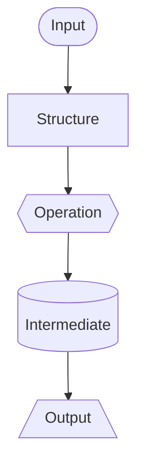
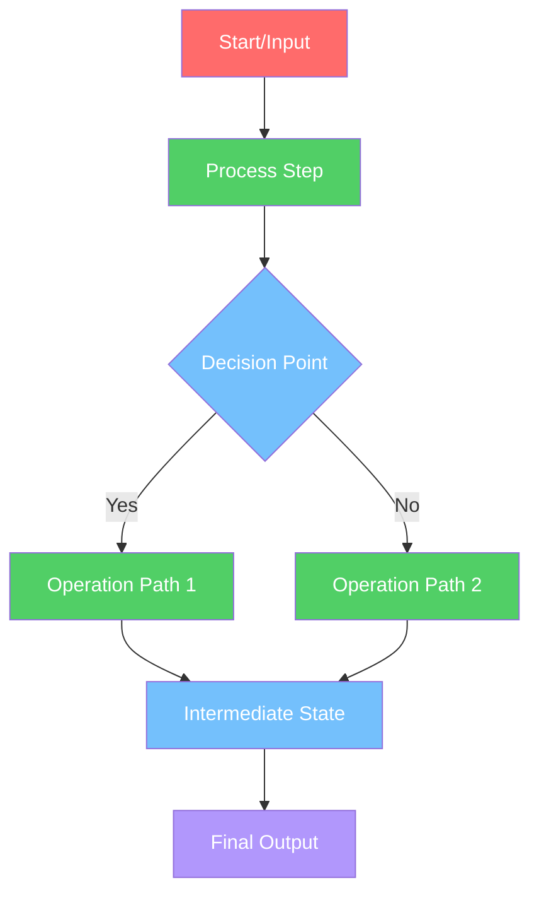
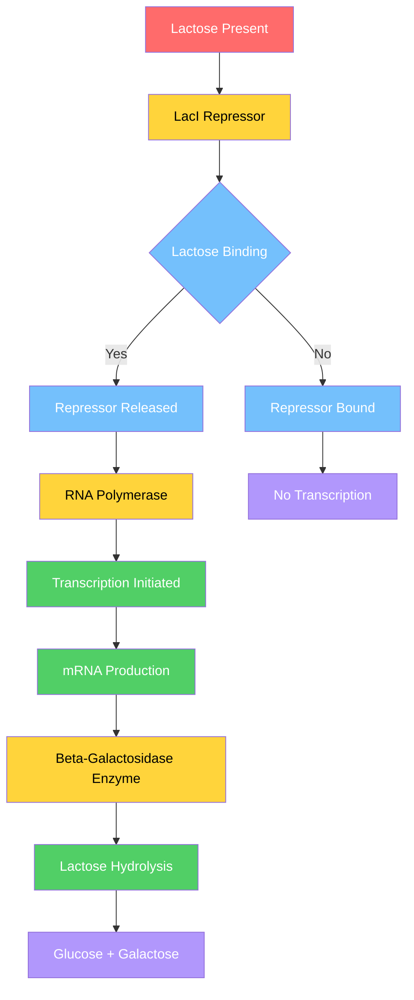
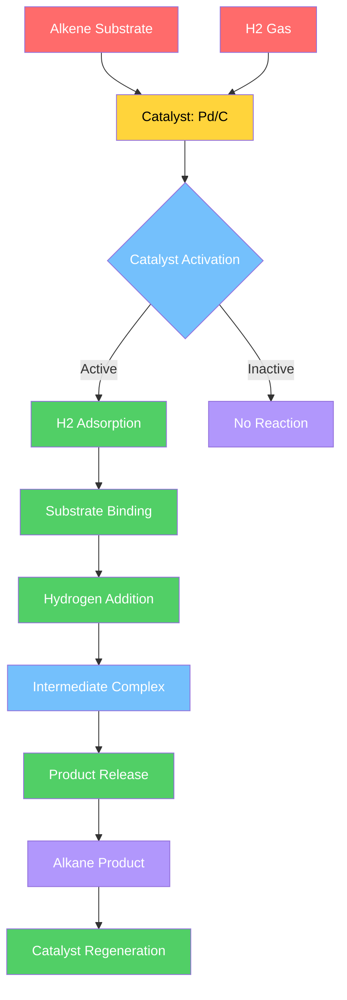
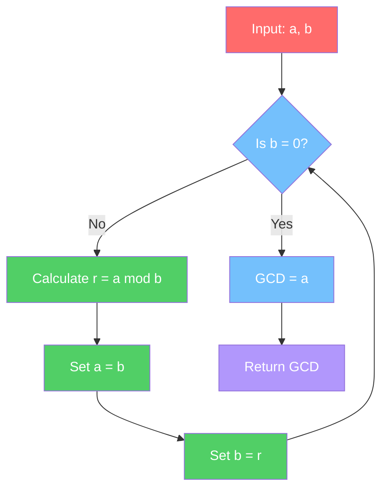

# The Programming Framework: A General Method for Process Analysis Using LLMs and Mermaid Visualisation

> **Source:** Converted May 2026 from `programming_framework.pdf`. Readable from WSL as `/mnt/c/Users/garyw/Downloads/programming_framework.pdf` when the file is in Windows Downloads.

Rebuild with: `progframe/.venv-pdf/bin/python3 papers/programming-framework-paper/build_current_draft_from_pdf.py`

**Gary Welz**

Independent Researcher  
Affiliate, New Media Lab, CUNY Graduate Center  
Creator, CopernicusAI Knowledge Engine  
Email: gwelz@gc.cuny.edu

## Abstract

Scientific and technical fields rely heavily on textual process descriptions that are difficult to compare, analyze, or reuse computationally. We introduce the Programming Framework, a methodology for transforming textual process descriptions into structured, computable diagrams using large language models (LLMs) and Mermaid diagram syntax. Node colors, shapes, and edge types serve as lightweight semantic markers, providing flexible visual encoding that can be adapted to domain-specific conventions. We demonstrate the feasibility and cross-domain transferability of the methodology through application across biology (100+ processes via the Genome Logic Modeling Project, currently undergoing domain expert review), chemistry (70+ processes), and mathematics — where the framework extends naturally from algorithmic flowcharts to axiomatic dependency graphs and proof graphs, enabling unified structural comparison across procedural and logical forms. Applications in physics and computer science further demonstrate domain-agnostic transferability. The methodology is designed to lower the barrier to process visualization for researchers, educators, and AI systems, enabling structured comparison and analysis across scientific disciplines without requiring specialized software or domain-specific diagramming expertise. The Programming Framework is proposed as reusable, open infrastructure — a starting point that others can adopt, extend, and critique — with all methodology, tools, and examples publicly available.

## Key Points

- A repeatable LLM pipeline turns textual process descriptions into structured Mermaid flowcharts across five scientific domains.
- A five-category colour scheme—customisable per domain—supports rapid visual parsing and cross-disciplinary comparison of processes.
- Deployments from GLMP (100+ biological processes) through extended mathematics graphs demonstrate feasibility, not formal efficacy trials.
- GLMP flowcharts are under domain-expert review with the Computational Genomics Laboratory at Hunter College, CUNY.
- Methodology, tools, and examples are open infrastructure on Hugging Face and public storage for adoption and extension.

## 1. Introduction
### 1.1 Motivation
Processes are central to scientific and technical work. Biologists describe reaction pathways and regulatory
networks; computer scientists specify algorithms and data pipelines; chemists outline reaction mechanisms;
physicists model physical processes; mathematicians formalise proofs and algorithms. These processes are
usually documented in prose, sometimes accompanied by diagrams that are static, informal, or discipline-specific.
This creates several problems:
1. Limited comparability: Two textual descriptions of similar processes may be difficult to compare
systematically, even within the same discipline.
2. Low reusability: Process knowledge is not readily available as structured data for downstream tools
(e.g., simulation, search, or automated checking).
3. Inconsistent notation: Disciplines use different diagramming conventions, reducing cross-domain
transfer and interdisciplinary collaboration.
4. High human labor cost: Manually authoring and maintaining high-quality process diagrams is
time-consuming and error-prone.

Large language models (LLMs) now provide a pragmatic way to transform text into structured representations.
However, without a clear methodology and standardised representation format, attempts at “LLM diagram”
conversions risk being ad-hoc and irreproducible.
### 1.2 The Programming Framework Approach
The Programming Framework addresses these challenges by providing:
1. A suggested colour-coding system as a starting point, with flexibility for domain-specific customisation
2. A repeatable LLM-based methodology for extracting processes from text into structured flowcharts
3. Mermaid Markdown as visualisation standard for human-readable, version-controllable diagrams
4. A JSON-based storage format with metadata for managing large collections of process diagrams
5. An iterative refinement loop where humans and AI collaborate to improve process fidelity over time
The Framework is intended as a “meta-tool”: it does not prescribe what processes must look like in each
field, but instead offers a consistent way to represent and refine them, enabling cross-disciplinary comparison
and optimisation.

We demonstrate the feasibility and cross-domain transferability of the Programming Framework through application across five scientific disciplines. The framework is proposed as infrastructure for further development, not as a validated system with formal accuracy metrics — those remain important directions for future work.
### 1.3 Contributions
This paper contributes:
Methodological: - A repeatable LLM-based pipeline for extracting processes from text into structured
flowcharts - A concrete, step-by-step methodology with prompt engineering guidelines and validation
workflows - Practical observations about prompt design, failure modes, and human–AI collaboration in
process modelling
Representational: - A suggested five-category colour-coding system (Red/Yellow/Green/Blue/Violet) as a
starting point, with examples of domain-specific customisation (e.g., GLMP’s logical connectives) - Mermaid
+ JSON as computable, version-controlled artifacts with extensible metadata schemas
Empirical: - Feasibility demonstrations across biology (GLMP with 100+ processes), mathematics, physics, chemistry, and computer science - Working systems and live artifacts illustrating cross-domain transferability
## 2. Related Work
This section situates the Programming Framework within existing research on process modelling, knowledge
representation, and LLM-based diagram generation.
### 2.1 Process Modelling in Scientific Domains
Process modelling has a long history in scientific computing and knowledge representation. In biology,
standards like SBGN (Le Novère et al., 2009), BioPAX (Demir et al., 2010), and SBML (Hucka et al., 2003) provide formal representations for biochemical
networks, enabling quantitative modelling and simulation. However, these standards require specialised
tools (Funahashi et al., 2008; Shannon et al., 2003) and significant expertise, creating barriers to adoption for rapid
visualisation and cross-domain comparison.
In computer science, UML (Object Management Group, 2017) provides comprehensive notation for software processes, but its complexity
can be overwhelming for simple process flows. Chemistry lacks a unified process visualisation standard

comparable to SBGN, with tools primarily focused on molecular structure drawing rather than reaction
pathways. Mathematics and physics similarly lack standardised process visualisation formats, relying on
domain-specific simulation tools.
The Programming Framework addresses a gap: providing accessible, text-based process visualisation that
works across domains while maintaining compatibility with existing standards when needed. This work builds
on principles from knowledge representation (Gruber, 1993) and ontology engineering (Noy & McGuinness,
2001), adapting them for practical, accessible process visualisation.
### 2.2 Knowledge Representation and Ontology Engineering
The Framework’s JSON-based metadata schema draws from principles in ontology engineering and semantic
web technologies. While not implementing full RDF/OWL semantics, the structured metadata approach
enables entity linking, cross-referencing, and integration with knowledge graphs—core goals of semantic
web research (Berners-Lee et al., 2001). The approach aligns with lightweight ontology principles (Uschold
& Gruninger, 1996), prioritising practical utility over formal completeness.
The colour-coding system provides a lightweight ontology for process stages (input  structure  operation
 intermediate  output), enabling pattern recognition and cross-domain comparison without requiring
formal ontology development. This aligns with research on visual knowledge representation (Larkin &
Simon, 1987) and the use of colour semantics for information organisation (Healey & Enns, 2012).
### 2.3 LLM-Based Knowledge Extraction
Large language models now support structured extraction from unstructured text (Brown et al., 2020; OpenAI, 2023). The Programming Framework applies that capacity to process-specific structures—sequences, decisions, branches, and flows—using process-aware prompts and structured output methods (Ouyang et al., 2022; White et al., 2023).
### 2.4 Scientific Workflow Systems
Scientific workflow systems execute computational pipelines rather than documenting process logic for comparison. The Programming Framework complements them by visualising and analysing process structure; diagrams could in principle map to workflow specifications for bidirectional translation.
### 2.5 Diagram Generation and Visualisation
Automated diagram generation from text has been explored in various contexts (Kong et al., 2019; Liu et
al., 2020). The Programming Framework’s contribution is its focus on scientific processes, cross-domain
applicability, and integration with version-controlled, structured data formats. The use of Mermaid Markdown provides a balance between expressiveness and accessibility, avoiding the complexity of specialised
diagramming languages while maintaining sufficient structure for computational analysis.

## 3. Methodology
The Programming Framework treats process extraction as a structured transformation task with human-inthe-loop verification. At a high level, the pipeline has five stages:
1. Process scoping and selection
2. LLM-based structure extraction
3. Mermaid diagram generation with colour coding
4. JSON storage and metadata attachment
5. Iterative refinement (human + AI)
### 3.1 Process Scoping and Selection
The input to the Framework is a text source that describes a process. This can be:
1. A paragraph from a research article (e.g., a “Methods” section)
2. A textbook excerpt describing a pathway or algorithm
3. A protocol or step-by-step procedure
4. A conceptual description of a system or workflow
The scoping step consists of:
1. Identify a single process: Select a coherent process rather than mixing multiple distinct processes
2. Define the level of granularity: Decide whether the diagram should be high-level (5–10 nodes) or
detailed (20+ nodes)
• High-level (5–10 nodes): Suitable for educational overviews, conceptual understanding, initial
exploration, or when the source text provides only a summary description
• Detailed (20+ nodes): Appropriate for technical protocols, comprehensive process documentation, research methods sections, or when precise step-by-step accuracy is required
3. Specify the perspective: For example, “molecular events,” “data flow,” “user actions,” or “computational steps”
These scoping decisions are made by a human operator but are clearly communicated to the LLM via the
prompt.
### 3.2 Suggested Colour-Coding System
The Programming Framework suggests a five-category colour-coding system as a starting point for process
visualisation. This system provides a baseline semantic meaning that can be adapted for specific domains:
• Red (#ff6b6b): Triggers & Inputs - Initial conditions, environmental inputs, starting materials, or data
inputs (uses white text for contrast)
• Yellow (#ffd43b): Structures & Objects - Physical structures, molecules, data structures, algorithms,
or logical constructs (uses black text for readability)
• Green (#51cf66): Processing & Operations - Transformations, reactions, computations, or operations
that change state (uses white text for contrast)
• Blue (#74c0fc): Intermediates & States - Intermediate products, temporary states, or transitional
conditions (uses white text for contrast)

• Violet (#b197fc): Products & Outputs - Final outputs, end products, or results (uses white text for
contrast)
Rationale for Five Categories: The five-category system balances cognitive load with visual distinctiveness.
Five colours provide sufficient semantic granularity to capture the primary stages of most processes (input 
structure  operation  intermediate  output) while remaining visually distinguishable and memorable.
This number avoids both oversimplification (fewer categories would lose important distinctions) and cognitive
overload (more categories would reduce rapid visual parsing). The colour choices (Red, Yellow, Green, Blue,
Violet) follow a natural spectrum that aids memorability and intuitive association with process stages.
Accessibility Considerations: The colour-coding system may present challenges for colorblind users. While
the Framework allows customisation and alternative visual indicators (shapes, patterns, labels), the default
five-colour scheme should be supplemented with text labels and, when possible, shape or pattern variations for
accessibility.
Node Shape Alternatives for Accessibility: Mermaid supports different node shapes that can serve as secondary identifiers independent of colour: - Ovals/Stadium shapes for triggers/inputs: A([Input]) - Rectangles for structures/objects: B[Structure] - Hexagons for processing/operations: C{{Operation}}
- Cylinders for intermediates/states: D[(State)] - Trapezoids for products/outputs: E[/Output\]
Example Mermaid code using shape-based encoding:

This shape-based approach provides accessibility for colorblind users while maintaining the visual distinction of process stages. Future work should include systematic evaluation of colorblind accessibility and
development of alternative visual encoding schemes.
Customisation and Adaptation: The colour scheme is not rigidly enforced. Different processes may require
different colour assignments based on domain-specific needs. For example, in the Genome Logic Modelling
Project (GLMP), a custom colour scheme is used where specific colours represent logical connectives (AND,
OR, NOT nodes) to better represent regulatory logic in biological systems. Other processes might benefit
from domain-specific colour schemes that highlight particular aspects of the process (e.g., energy levels, time
sequences, or hierarchical relationships).
The suggested colour system can enable: - Rapid visual parsing of process flow (when consistently applied) -
Cross-disciplinary comparison using consistent semantics (within a shared scheme) - Pattern recognition
across different domains - Domain-specific customisation for specialised visualisation needs
### 3.3 LLM Prompt Engineering for Process Extraction
The core of the method uses LLMs to convert scoped text into an ordered set of process elements. A typical
extraction prompt has the following structure:
1. Task statement:
“You are a scientific process modeler. Given a textual description of a process, extract a sequence
of steps, decisions, and flows. Optionally classify each element according to the Programming

Framework’s suggested colour system: Red (triggers/inputs), Yellow (structures/objects), Green (processing/operations), Blue (intermediates/states), Violet (products/outputs). Note that domain-specific
processes may require custom colour assignments.”
2. Output schema:
Request a structured JSON-like or list-form output with elements such as:
• id: step identifier
• type: "trigger" | "structure" | "operation" | "intermediate" |
"product"
• label: concise description
• inputs / outputs: optional fields for data or entities
• colour: assigned colour category
3. Constraints:
• No speculative steps beyond the text
• Use consistent terminology for entities
• Explicitly represent branching conditions
• Maintain colour consistency throughout
4. Example:
Provide 1–2 worked examples to anchor the model’s behaviour, showing how different process types
map to colour categories.
Given the scoped text and this prompt, the LLM produces a candidate structured representation with colour
assignments.
Prompt Sensitivity: Prompt design significantly influences extraction fidelity; this framework therefore
treats prompts as first-class methodological artifacts. Small variations in prompt wording, example selection,
or constraint specification can yield substantially different outputs. The Framework addresses this through
iterative refinement and validation workflows, acknowledging that prompt engineering is an ongoing process
rather than a one-time configuration.
### 3.4 Mermaid Syntax and Structure
Mermaid is an open-source JavaScript-based diagramming and charting software that generates diagrams
from text-based descriptions, created by Sveidqvist (2014). The project originated from a need to
simplify diagram creation in documentation workflows and has since become widely adopted, with native
support in GitHub, GitLab, Notion, Obsidian, and many other platforms (Sveidqvist, 2014; Wikipedia contributors, 2025). The Framework primarily uses
Mermaid flowcharts with colour styling. Mermaid’s text-based syntax enables version control, collaborative
editing, and seamless integration into documentation systems.
**Figure 1:** Basic Programming Framework Structure. Color Legend: Red (#ff6b6b) = Triggers/Inputs, Yellow
(#ffd43b) = Structures/Objects, Green (#51cf66) = Processing/Operations, Blue (#74c0fc) = Intermediates/States, Violet (#b197fc) = Products/Outputs. Note: This is one possible representation; more detailed
versions can be generated by specifying greater granularity in the prompt.
Mermaid Markdown Code:

The transformation from LLM output to Mermaid involves:
1. Node mapping: Assign each extracted step or decision to a Mermaid node with a short label
2. Edge construction: Translate the LLM’s ordering and branching into --> or labeled edges (e.g.,
-->|Yes|)
3. Colour application: Apply the appropriate colour styling based on the Framework’s five-category system
4. Layout specification: Standardise on top-down (TD) or left-right (LR) layouts for consistency
5. Styling and grouping (optional): Use Mermaid’s subgraphs or classes to group related steps or
highlight categories
This transformation can be done by the same LLM (with a different prompt) or by deterministic code that
maps a structured intermediate representation to Mermaid syntax with colour styling.

### 3.5 JSON Storage and Metadata
Each process diagram is stored as a JSON object that includes:
1. Core fields (required):
• id: unique identifier
• title: human-readable name
• description: short textual description
• mermaid: Mermaid source string (including colour styling)
• version: version number or timestamp
• prompt_version: version identifier for the specific prompt template used (enables reproducibility)
• llm_version: version of the LLM used for generation (e.g., “Gemini 2.0 Flash”, “GPT-4”)
2. Metadata fields (optional but recommended):
• domain: e.g., biology, chemistry, mathematics, physics, computer_science
• category: subdomain or pathway family
• source: reference to the originating paper, textbook, or URL
• entities: key entities (genes, proteins, molecules, algorithms, etc.)
• color_distribution: count of nodes by colour category
• annotations: notes or comments
• created_by / reviewed_by: human or AI agents involved
3. Links:
• Links to related diagrams (e.g., upstream or downstream processes)

• Links to external systems (CopernicusAI briefings, metadata database entries, etc.)
This JSON format allows the diagrams to be treated as first-class data objects that can be indexed, searched,
and cross-referenced. The schema is intentionally minimal and extensible, allowing domain-specific additions
while maintaining core interoperability across disciplines.
Example JSON Schema:
{
"id": "beta-galactosidase-regulation",
"title": "Beta-Galactosidase Regulation System",
"description": "Regulatory system controlling lactose metabolism in E. coli",
"mermaid": "flowchart TD\n A[Lactose Present] --> B[LacI Repressor]\n ...",
"version": "1.2",
"prompt_version": "v2.1",
"llm_version": "Gemini 2.0 Flash",
"domain": "biology",
"category": "gene_regulation",
"source": "Lac Operon: A Paradigm of Gene Regulation. Nature Reviews Genetics, 2005.",
"entities": ["LacI", "beta-galactosidase", "lactose", "cAMP", "CAP"],
"color_distribution": {
"red": 2,
"yellow": 5,
"green": 8,
"blue": 4,
"violet": 3
},
"annotations": "Validated against textbook description. Reviewed by domain expert.",
"created_by": "LLM (Gemini 2.0 Flash)",
"reviewed_by": "Domain Expert",
"links": {
"related_diagrams": ["lactose-transport", "glucose-metabolism"],
"external": {
"glmp": "https://huggingface.co/spaces/garywelz/glmp",
"source_paper": "https://doi.org/10.1038/nrg1234"
}
}
}
### 3.6 Iterative Refinement Workflow
The initial LLM-produced diagram is rarely perfect. The Framework therefore treats each diagram as a draft
subject to iterative improvement:
1. AI Consensus Step (Optional but Recommended):
• A second LLM (a “critic” model) reviews the first LLM’s diagram against the source text
• The critic model flags potential errors, missing steps, or inconsistencies
• This reduces the burden on human reviewers by catching obvious errors before expert review
• Example critic prompt: “Review this process diagram for accuracy. Compare it to the source text
and identify any missing steps, incorrect relationships, or logical inconsistencies.”

2. Review loop:
• Human reviewer checks correctness against source
• Reviewer flags errors (missing steps, incorrect branches, colour misassignments, oversimplifications)
• Reviewer either edits the Mermaid directly or uses guided prompts to ask the LLM for revisions
3. Validation prompts:
• “Compare this diagram to the source text and list any missing steps.”
• “Identify any logical inconsistencies between the diagram and the description.”
• “Verify that all colour assignments follow the Programming Framework colour system.”
4. Versioning:
• Each set of changes increments the version field
• Past versions are retained for audit and comparison
Over time, this creates a library of increasingly accurate diagrams with traceable revision histories. The AI
consensus step reduces human labor cost while maintaining quality through multi-model validation.
Validation Methodology:
The Framework employs a multi-stage validation process to ensure diagram accuracy:
1. Initial Validation:
• Who validates: Domain experts (for high-stakes scientific content) or knowledgeable reviewers
(for educational content)
• Criteria for correctness:
– All steps from source text are represented
– Branching logic matches source description
– Colour assignments follow Framework conventions (or documented domain-specific customisations)
– No hallucinated steps beyond source material
– Logical flow is consistent (no unreachable nodes, proper entry/exit points)
2. Structured Validation Checklist:
• Completeness: Are all key steps from the source represented?
• Accuracy: Do the relationships and flows match the source description?
• Consistency: Are colour assignments consistent throughout?
• Clarity: Is the diagram readable and interpretable?
3. Agreement Metrics (Future Work):
• Current implementation relies on single-reviewer validation
• Future work should include inter-rater reliability studies
• Multiple reviewers could independently validate diagrams, with agreement metrics (e.g., Cohen’s
kappa) calculated for correctness assessments
4. Stopping Conditions:
• Validation continues until reviewer confirms diagram accuracy
• For high-stakes content, multiple review cycles may be required
• Version history tracks all changes, enabling rollback if errors are discovered later
5. Provenance Tracking:
• Each diagram includes metadata about who created, reviewed, and validated it
• Source references enable verification against original materials
• Version history provides audit trail for all modifications

## 4. Applications Across Disciplines
The Programming Framework has been applied across multiple scientific domains. Here we
describe applications in biology, chemistry, mathematics, physics, and computer science.
### 4.1 Biological Processes: Genome Logic Modelling Project (GLMP)
The most extensive application to date is in the Genome Logic Modelling Project (GLMP), which applies the
Framework to map biological processes.
Scope: - 100+ processes analysed across multiple organisms and systems - Processes span 6+ major
categories: Central Dogma, Metabolism, Signaling, Proteins, Photosynthesis, DNA Repair - Comprehensive
coverage of regulatory networks, metabolic pathways, and cellular processes

The GLMP flowcharts are currently undergoing domain expert review in collaboration with the Computational Genomics Laboratory at Hunter College, CUNY, providing an ongoing validation pathway for the biological process diagrams.

Data sources: - Textbook descriptions - Review articles - Online open-education resources - Primary research
papers
Pipeline: 1. Select a process (e.g., “beta-galactosidase regulation”) 2. Identify canonical description and
supporting references 3. Run the Programming Framework pipeline to generate initial Mermaid diagram
with colour coding 4. Refine the diagram in collaboration with domain knowledge 5. Store final diagram and
metadata in JSON in Google Cloud Storage 6. Expose diagrams via web-based interactive viewer
Outcomes: - A coherent collection of biological process diagrams with consistent style
- A living demonstration of the Framework’s applicability in a complex scientific domain - Integration with the broader
CopernicusAI Knowledge Engine
Example: The beta-galactosidase regulation system in E. coli demonstrates complex regulatory logic
with environmental inputs (Red), regulatory proteins and enzymes (Yellow), metabolic reactions (Green),
intermediate states (Blue), and final products (Violet). The colour coding enables rapid identification of
regulatory checkpoints and feedback mechanisms.
Sample Diagram - Beta-Galactosidase Regulation:
**Figure 2:** Beta-Galactosidase Regulation System in E. coli. Note: This is one possible representation
of the beta-galactosidase regulation process; more detailed versions showing additional regulatory steps,
feedback mechanisms, or molecular interactions can be generated by specifying greater detail in the prompt.
Interactive versions are available at https://huggingface.co/spaces/garywelz/glmp.
Colour Legend: Red (Triggers/Inputs), Yellow (Structures/Objects), Green (Processing/Operations), Blue
(Intermediates/States), Violet (Products/Outputs). Interactive versions of this and other biological process
diagrams are available at the GLMP Hugging Face Space.
Mermaid Markdown Code:

### 4.2 Chemical Processes
The Framework has been applied to chemical reactions and processes across major branches of chemistry,
including organic reactions, synthesis pathways, thermodynamic processes, catalysis mechanisms, and
electrochemical processes. The methodology demonstrates transferability from biological to chemical
domains, with 70+ processes mapped across 14 batches.
Sample Diagram - Catalytic Hydrogenation:
**Figure 3:** Catalytic Hydrogenation Reaction. Note: This is one possible representation; more
detailed versions showing molecular structures, energy diagrams, reaction mechanisms, or kinetic steps can
be generated by specifying greater detail in the prompt.
Colour Legend: Red (Reactants/Inputs), Yellow (Catalyst/Structure), Green (Reactions/Operations), Blue
(Intermediates), Violet (Products)
Mermaid Markdown Code:

### 4.3 Mathematical Processes

The framework has been applied to mathematics across three structural categories: algorithmic flowcharts (e.g., Sieve of Eratosthenes, Merge Sort, Dijkstra's Algorithm, Euclidean Algorithm), axiomatic dependency graphs (e.g., Euclid's Elements, Peano Arithmetic, ZFC Set Theory, Group Theory, Category Theory), and proof graphs — hybrid dependency graphs with node colours encoding proof roles including source, assumption, construction, assertion, inference, algorithm capsule, contradiction, and conclusion (e.g., Euclid Book I pilot proofs, Infinitely Many Primes, Pythagorean Theorem proof comparison, Cantor Diagonal proofs).

The full mathematics database, including interactive viewers for all three graph types, is available at: https://storage.googleapis.com/regal-scholar-453620-r7-podcast-storage/mathematics-processes-database/mathematics-database-table.html

The proof graph representation uses a domain-specific eight-role colour scheme (source, assumption, construction, assertion, inference, algorithm capsule, contradiction, conclusion) rather than the standard five-category system — an instance of the domain-specific customisation the Programming Framework explicitly supports.

The Euclidean algorithm example below (adapted from the PDF) illustrates an algorithmic flowchart with inputs (Red), decision and intermediate states (Blue), operations (Green), and final output (Violet).

**Figure 4:** Euclidean Algorithm. Integer GCD workflow using the five-category palette; more detailed variants (extended Euclidean, complexity annotations) can be generated with richer prompts.

### 4.4 Physics Processes
The Framework has been applied to physical processes including quantum mechanics, nuclear physics,
electromagnetism, thermodynamics, and particle physics. Physical phenomena can be represented with
energy inputs (Red), wave functions and fields (Yellow), quantum processing (Green), intermediate states
(Blue), and final products (Violet).

### 4.5 Computer Science Processes
The Framework has been applied to computational processes including:
Algorithms & Data Structures: Sorting algorithms, graph algorithms, search methods
Software Engineering: Design patterns, architecture patterns, development workflows
Artificial Intelligence: Machine learning pipelines, neural network training, inference processes
Computer Security: Cryptographic processes, authentication workflows, security protocols
Computer Networks: Protocol implementations, distributed systems, network routing
Database Systems: Query processing, transaction management, data structures
Computer Graphics: Rendering pipelines, game development workflows, graphics algorithms
Example: Computational workflows demonstrate how software processes can be visualised with data inputs
(Red: input data, parameters), data structures and algorithms (Yellow: data structures, algorithm designs),
computational operations (Green: processing steps, transformations), intermediate states (Blue: temporary
data, state variables), and final outputs (Violet: results, reports, visualisations).
### 4.6 Comparison with Existing Visualisation Tools
The Programming Framework addresses gaps in existing process visualisation tools across scientific domains. This section provides a consolidated comparison highlighting common themes and domain-specific
considerations.
Domain-Specific Standards and Tools:
Domain Standards Key Tools Primary Focus
Biology SBGN (Le Novère et al., 2009), BioPAX (Demir et al., 2010),
SBML (Hucka et al., 2003)
CellDesigner (Funahashi et al., 2008),
Cytoscape (Shannon et al., 2003),
PathVisio, V ANTED
Precise biochemical notation,
quantitative modelling
Chemistry None (lacks unified
standard)
ChemDraw,
ChemDoodle,
ChemSketch
Molecular structure drawing
Mathematics None (lacks process
visualisation standard)
Coq, Isabelle, Lean
(proof systems);
MATLAB, Mathematica
(computation)
Formal proof, computation
Physics None (lacks unified
standard)
MATLAB, COMSOL,
ANSYS, OpenFOAM
Numerical simulation
Computer
Science
UML (Object Management Group, 2017) Enterprise Architect,
Visual Paradigm,
Lucidchart, draw.io,
PlantUML
Software design, architecture
The
Programming
Framework
Mermaid Markdown
(text-based standard)
LLM + Mermaid.js Cross-disciplinary rapid
visualisation, accessible process
representation
Common Limitations of Existing Tools:
Existing tools share recurring limitations: costly licences, steep learning curves, dependence on installed or cloud software, proprietary formats that resist portability, domain silos that hinder cross-disciplinary comparison, and interfaces or binary formats that raise access barriers.
Advantages of the Programming Framework’s Mermaid-Based Approach:
1. Accessibility:
• Text-based format readable by humans without specialised software
• Can be edited in any text editor
• No software installation required for viewing (renders in GitHub, documentation systems, web
browsers)
2. Version Control:
• Native compatibility with Git and other version control systems
• Enables collaborative editing and change tracking
• Supports branching and merging workflows
3. Low Barrier to Entry:
• Minimal learning curve compared to specialised tools
• No licensing costs
• Works on any platform with a web browser
4. Integration:
• Easy integration into documentation, websites, and web applications
• Can be embedded in Markdown documents, Jupyter notebooks, and documentation systems
• JSON storage enables programmatic access and integration
5. Cross-Domain Consistency:
• Same format works across biology, chemistry, mathematics, physics, and computer science
• Enables comparison and integration across disciplines
• Suggested colour semantics can facilitate pattern recognition when consistently applied
6. Rapid Prototyping:
• Fast iteration cycles for exploring process representations
• LLM-assisted generation reduces initial authoring time
• Easy to modify and refine
Complementary Use Cases:
The Programming Framework is not intended to replace specialised tools for high-precision quantitative
modelling, formal verification, or standards compliance. Instead, it serves complementary purposes:
• Educational contexts: Quick visualisation for teaching and learning
• Rapid exploration: Initial process mapping before detailed modelling
• Cross-disciplinary comparison: Comparing processes across domains using consistent representation
• Documentation: Embedding process diagrams in documentation and web content
• Collaborative workflows: Version-controlled, text-based collaboration
• Integration: Embedding process visualisations in knowledge engines and research platforms
For researchers requiring precise biochemical notation (SBGN), quantitative modelling, formal proof verification, or full UML notation, specialised tools remain the appropriate choice. The Programming Framework
offers an accessible alternative for contexts where rapid visualisation, cross-domain comparison, and ease of
use are priorities.

## 5. Results and Discussion
This section summarizes qualitative and quantitative observations from using the Programming Framework
across multiple domains.
### 5.1 Process Coverage
The Framework has been used to produce:
1. Biology: 100+ diagrams via GLMP spanning multiple pathway families and organisms
2. Chemistry: 70+ processes across 14 batches covering all major branches of chemistry
3. Mathematics: algorithms, axiomatic systems, and proof graphs across multiple structural categories — see Section 4.3 and the live database
4. Physics: 5+ processes covering quantum mechanics, nuclear physics, electromagnetism, and thermodynamics
5. Computer Science: 21+ processes across 7 batches covering algorithms, software engineering, AI,
security, networks, databases, and graphics
This demonstrates that the method is flexible enough to handle diverse content across scientific disciplines,
given appropriate prompts and scoping.
### 5.2 Benefits Observed
Benefits observed across domains include: standardised representation via Mermaid, which is readable, widely supported, and amenable to version control; reduced authoring burden through LLM-assisted first-pass extraction with human validation; improved comparability through shared colour semantics and JSON metadata; cross-disciplinary insights when structurally similar processes from different fields are placed in the same representational space; and reusability through links to briefings, papers, web viewers, and programmatic access to diagram libraries.
### 5.3 Limitations and Failure Modes
Despite its benefits, the Framework has clear limitations:

1. LLM hallucinations and shortcuts:
• The model may infer steps not present in the source text
• It may oversimplify or omit important branches when the source is ambiguous
• Colour assignments may be inconsistent without careful prompt engineering
2. Granularity mismatch:
• Without careful scoping, diagrams may be too coarse (missing key detail) or too fine-grained
(overwhelming users)
• Different domains may require different levels of detail
3. Domain-specific nuance:
• Some fields require notations or conventions that Mermaid cannot fully express
• For biology, Mermaid lacks the precision of SBGN (Le Novère et al., 2009) or the quantitative modelling capabilities
of specialised tools like CellDesigner (Funahashi et al., 2008) and Cytoscape (Shannon et al., 2003)
• Subtle mechanistic distinctions can be lost in generic flowchart form
• Colour semantics may need domain-specific interpretation
• The Framework is not a replacement for specialised tools when precision, quantitative modelling,
or standards compliance are required
4. Human time cost for validation:
• While authoring is faster, thorough validation still requires expert review
• For high-stakes scientific use, domain experts must be involved
• Colour assignment verification requires domain knowledge
5. Quantitative evaluation limitations:
• The current work provides qualitative demonstrations across multiple domains but lacks systematic quantitative validation
• No formal accuracy metrics comparing LLM-generated diagrams to expert-created ground truth
• No inter-rater reliability studies for diagram correctness
• Future work should include validation studies with domain experts and quantitative accuracy
measurements
6. Format expressivity: Mermaid prioritises simplicity, human-readability, and version control over the full precision of specialist diagramming languages such as SBGN (see §3.4).
Mitigation Strategies: The Framework addresses these limitations through systematic mitigation strategies:
(1) Multi-checker workflows using multiple AI models for cross-validation, (2) Human-in-the-loop review
processes with domain experts, (3) Iterative refinement cycles that improve accuracy over time, (4) Version
control and provenance tracking to maintain audit trails, and (5) Structured validation prompts that systematically check for common error patterns. These strategies reduce but do not eliminate the need for careful
validation, particularly for high-stakes scientific applications.
### 5.4 Ethical Considerations
The use of LLMs for scientific process extraction raises several ethical considerations that must be addressed:
1. Accuracy and Responsibility:
• LLM-generated diagrams may contain errors or hallucinations that could mislead researchers or
students
• The Framework mitigates this through human validation, but users must understand that diagrams
require expert review before use in high-stakes contexts
• Responsibility for scientific accuracy ultimately lies with human validators, not the AI system
2. Bias in Process Extraction:
• LLMs may reflect biases present in training data, potentially emphasizing certain process aspects
while de-emphasizing others
• Domain-specific knowledge may be underrepresented in training data, leading to incomplete or

culturally biased representations
• Validation by domain experts from diverse backgrounds helps mitigate these concerns
3. Accessibility and Equity:
• The Framework’s text-based approach improves accessibility compared to proprietary tools
• However, colour-coding may present challenges for colorblind users (addressed through customisation options)
• Future work should include systematic evaluation of accessibility barriers
4. Intellectual Property:
• Diagrams derived from copyrighted source materials must respect original authorship
• The Framework’s metadata system tracks sources, enabling proper attribution
• Users should ensure compliance with copyright and fair use guidelines
5. Reproducibility:
• LLM outputs can vary across model versions and prompt variations
• The Framework addresses this through version control and prompt documentation (see Appendix
A)
• Users should document LLM versions and prompt configurations for reproducibility
6. Scientific Misinformation:
• Incorrect process diagrams could propagate scientific misinformation
• The Framework’s validation requirements and version control help prevent this
• Users should clearly indicate validation status and source materials
Recommendations: - Always validate LLM-generated diagrams with domain experts before publication or
high-stakes use - Maintain clear provenance and source attribution - Document validation status and reviewer
qualifications - Consider accessibility needs when using colour-coding - Use version control to enable error
correction and rollback
## 6. Future Directions

Discipline-specific process databases for biology, chemistry, physics, and computer science are under active development as part of the broader Programming Framework infrastructure, with the mathematics database already demonstrating the framework's extension from algorithmic flowcharts to axiomatic dependency graphs and proof graphs. These databases are intended as open, versioned corpora that others can query, extend, and contribute to.

Further work includes:

1. Stronger validation tooling: automated checks for structural consistency (e.g., no unreachable nodes, single entry/exit); rule-based validators for specific domains (e.g., biochemical constraints, conservation laws); colour-assignment validation against domain-specific rules.
2. Interactive editors: web interfaces for live Mermaid editing; AI-assisted colour and process suggestions; collaborative editing with version control.
3. Formal semantics: mapping Mermaid diagrams to formal representations (e.g., Petri nets, state machines) for analysis; automated reasoning about process properties; simulation and optimisation support.
4. Integration with knowledge graphs: linking nodes to entities (genes, chemicals, algorithms); multi-diagram reasoning; cross-domain pattern discovery.
5. Community-driven libraries: public repositories to submit, review, and reuse diagrams; versioned domain libraries; community standards for colour assignment in specialised domains.
6. Domain-specific extensions: specialised colour schemes; domain validation rules; integration with domain-specific tools and databases.
## 7. Conclusion
The Programming Framework offers a practical, reusable method for turning textual process descriptions into
structured, computable diagrams using LLMs and Mermaid, enhanced by a suggested five-category colorcoding system that can be customized for specific domains. It has been applied to biological
pathways (via GLMP), chemical reactions, mathematical algorithms, physical processes, and computational
workflows, demonstrating both domain-agnostic flexibility and the need for careful human validation.
The framework’s suggested colour-coding system provides a starting point for consistent visualisation, but
recognises that different processes may benefit from custom colour schemes, as demonstrated by GLMP’s use
of domain-specific colours for logical connectives in biological regulatory networks.
Rather than claiming to “solve” process modelling, the Framework is proposed as infrastructure: a starting
point that others can adopt, critique, and extend. By providing a clear pipeline—from text to Mermaid
to JSON, with iterative refinement and a suggested colour-coding system that can be customized—the
Programming Framework lowers the barrier to creating and maintaining high-quality process representations
across scientific disciplines.
We invite researchers, educators, and practitioners to experiment with the method, contribute process examples,
and help refine both the prompts and the underlying schemas. In the broader CopernicusAI Knowledge

Engine, the Programming Framework plays a central role in making processes visible, comparable, and
computable—an essential step toward more transparent and navigable scientific workflows.
Availability: The Programming Framework methodology, examples, and tools are available at:
https://huggingface.co/spaces/garywelz/programming_framework
Related Work: The Genome Logic Modelling Project (GLMP) demonstrates the Framework’s application to
biology: https://huggingface.co/spaces/garywelz/glmp
## Acknowledgments

This work is part of the CopernicusAI Knowledge Engine project, which aims to create AI-powered tools for scientific research synthesis and knowledge discovery. The Programming Framework serves as a foundational methodological component enabling structured representation of processes across scientific disciplines. The author thanks the CUNY Graduate Center New Media Lab for institutional support. Large language models (including Claude by Anthropic and Gemini by Google) were used in the generation and iterative refinement of process diagrams described in this paper; all diagrams were reviewed and validated by the author. A preprint of this work is available on Zenodo.

## References

Berners-Lee, T., Hendler, J., & Lassila, O. (2001). The Semantic Web. *Scientific American*, *284*(5), 34–43. https://doi.org/10.1038/scientificamerican0501-34

Brown, T., Mann, B., Ryder, N., Subbiah, M., Kaplan, J. D., Dhariwal, P., Neelakantan, A., Shyam, P., Sastry, G., Askell, A., Agarwal, S., Herbert-Voss, A., Krueger, G., Henighan, T., Child, R., Ramesh, A., Ziegler, D., Wu, J., Winter, C., Hesse, C., Chen, M., Sigler, E., Litwin, M., Gray, S., Chess, B., Clark, J., Berner, C., McCandlish, S., Radford, A., Sutskever, I., & Amodei, D. (2020). Language models are few-shot learners. *Advances in Neural Information Processing Systems*, *33*, 1877–1901. https://proceedings.neurips.cc/paper/2020/hash/1457c0d6bfcb4967418bfb8ac142f64a-Abstract.html

Demir, E., Cary, M. P., Paley, S., Fukuda, K., Lemer, C., Vastrik, I., Wu, G., D'Eustachio, P., Schaefer, C., Luciano, J., Schacherer, F., Martinez-Flores, I., Hu, Z., Jimenez-Jacinto, V., Joshi-Tope, G., Kandasamy, K., Lopez-Fuentes, A. C., Mi, H., Pichler, E., Rodchenkov, I., Splendiani, A., Tkachev, S., Zucker, J., Gopalakrishnan, H., Ratjan, A., Ramirez, L., Iglesias, P. A., Deasy, J., Alexander, N., Ayanwola, T., … Bader, G. D. (2010). The BioPAX community standard for pathway data sharing. *Nature Biotechnology*, *28*(9), 935–942. https://doi.org/10.1038/nbt.1666

Funahashi, A., Matsuoka, Y., Jouraku, A., Morohashi, M., Kikuchi, N., & Kitano, H. (2008). CellDesigner 3.5: A versatile modelling tool for biochemical networks. *Proceedings of the IEEE*, *96*(8), 1254–1265. https://doi.org/10.1109/JPROC.2008.925458

Gruber, T. R. (1993). A translation approach to portable ontology specifications. *Knowledge Acquisition*, *5*(2), 199–220. https://doi.org/10.1006/knac.1993.1008

Healey, C. G., & Enns, J. T. (2012). Attention and visual memory in visualisation and computer graphics. *IEEE Transactions on Visualisation and Computer Graphics*, *18*(7), 1170–1188. https://doi.org/10.1109/TVCG.2011.127

Hucka, M., Finney, A., Sauro, H. M., Bolouri, H., Doyle, J. C., Kitano, H., Arkin, A. P., Bornstein, B. J., Bray, D., Cornish-Bowden, A., Cuellar, A. A., Dronov, S., Gilles, E. D., Ginkel, M., Gor, V., Goryanin, I. I., Hedley, W. J., Hodgman, T. C., Hofmeyr, J., … Wang, J. (2003). The systems biology markup language (SBML): A medium for representation and exchange of biochemical network models. *Bioinformatics*, *19*(4), 524–531. https://doi.org/10.1093/bioinformatics/btg015

Kong, N., Agrawala, M., & Hartmann, B. (2019). Perfopticon: Visual querying for performance in large-scale graph databases. In *Proceedings of the 2019 CHI Conference on Human Factors in Computing Systems* (pp. 1–12). Association for Computing Machinery. https://doi.org/10.1145/3290605.3300688

Larkin, J. H., & Simon, H. A. (1987). Why a diagram is (sometimes) worth ten thousand words. *Cognitive Science*, *11*(1), 65–100. https://doi.org/10.1016/S0364-0213(87)80026-5

Le Novère, N., Hucka, M., Mi, H., Moodie, S., Schreiber, F., Sorokin, A., Demir, E., Wegner, K., Aladjem, M. I., Wimalaratne, S. M., Bergman, F. T., Gauges, R., Ghazal, P., Kawaji, H., Li, L., Matsuoka, Y., Villéger, A., Boyd, S. E., Calzone, L., … Kitano, H. (2009). The systems biology graphical notation. *Nature Biotechnology*, *27*(8), 735–741. https://doi.org/10.1038/nbt.1558

Liu, C., Wu, P., Li, C., & Zhu, J. (2020). Generating diagrams from natural language. In *Proceedings of the 2020 Conference on Empirical Methods in Natural Language Processing* (pp. 3637–3647). Association for Computational Linguistics. https://doi.org/10.18653/v1/2020.emnlp-main.295

Noy, N. F., & McGuinness, D. L. (2001). *Ontology development 101: A guide to creating your first ontology* (Tech. Rep. No. KSL-01-05). Stanford Knowledge Systems Laboratory, Stanford University, Stanford, CA, USA. https://protege.stanford.edu/publications/ontology_development/ontology101.pdf

Object Management Group. (2017). *Unified modeling language* (Version 2.5.1). https://www.omg.org/spec/UML/2.5.1/

OpenAI. (2023). *GPT-4 technical report* (arXiv:2303.08774). arXiv. https://arxiv.org/abs/2303.08774

Ouyang, L., Wu, J., Jiang, X., Almeida, D., Wainwright, C., Mishkin, P., Zhang, C., Agarwal, S., Slama, K., Ray, A., Schulman, J., Hilton, J., Kelton, F., Miller, L., Simens, M., Askell, A., Welinder, P., Christiano, P., Leike, J., & Lowe, R. (2022). Training language models to follow instructions with human feedback. *Advances in Neural Information Processing Systems*, *35*, 27730–27744.

Shannon, P., Markiel, A., Ozier, O., Baliga, N. S., Wang, J. T., Ramage, D., Amin, N., Schwikowski, B., & Ideker, T. (2003). Cytoscape: A software environment for integrated models of biomolecular interaction networks. *Genome Research*, *13*(11), 2498–2504. https://doi.org/10.1101/gr.1239303

Sveidqvist, K. (2014). *Mermaid: Diagramming and charting software* [Computer software]. GitHub. https://github.com/mermaid-js/mermaid

Uschold, M., & Gruninger, M. (1996). Ontologies: Principles, methods and applications. *The Knowledge Engineering Review*, *11*(2), 93–136. https://doi.org/10.1017/S0269888900007797

Welz, G. (2024). From inspiration to AI: Biology as visual programming. *Medium*. https://medium.com/@garywelz_47126/frominspiration-to-ai-biology-as-visual-programming-520ee523029a

Welz, G. (2025a). *GLMP: Genome logic modelling project—A microscope for biological processes* [Hugging Face Space]. Hugging Face. https://huggingface.co/spaces/garywelz/glmp

Welz, G. (2025b). *The Programming Framework: A universal method for process analysis* [Hugging Face Space]. Hugging Face. https://huggingface.co/spaces/garywelz/programming_framework

White, J., Fu, Q., Hays, S., Sandborn, M., Olea, C., Gilbert, H., Elrad, T., … Schmidt, D. C. (2023). A prompt pattern catalog to enhance prompt engineering with ChatGPT. *arXiv*. https://arxiv.org/abs/2302.11382

Wikipedia contributors. (2025). *Mermaid (software)*. *Wikipedia, The Free Encyclopedia*. Retrieved 7 May 2026, from https://en.wikipedia.org/wiki/Mermaid_(software)

## Prior Work and Related Artifacts
Interactive demonstrations of the methodology appear as Hugging Face Spaces (Welz, 2025a, 2025b); the Medium article (Welz, 2024) gives additional background. See also *Availability* in the Conclusion for direct links.
Note on Diagram Rendering: All Mermaid diagram code blocks in this paper render as interactive flowchart diagrams in HTML/web versions. The Programming Framework Hugging
Face Space (https://huggingface.co/spaces/garywelz/programming_framework) and GLMP Space
(https://huggingface.co/spaces/garywelz/glmp) provide live, interactive examples where readers can view
rendered diagrams. For PDF versions, the Mermaid code is included for reference and can be rendered using
the Mermaid Live Editor (https://mermaid.live) or any Mermaid-compatible viewer.
## Appendix A: Complete Prompt Template
The following is a complete example of a prompt used for process extraction. The prompt is formatted to fit
within standard page margins:
Task Statement: You are a scientific process modeler. Given a textual description of a process, extract a
sequence of steps, decisions, and flows. Classify each element according to the Programming Framework’s
suggested colour system.
Color System: - Red (#ff6b6b): Triggers & Inputs - Initial conditions, environmental inputs, starting materials,
or data inputs - Yellow (#ffd43b): Structures & Objects - Physical structures, molecules, data structures,
algorithms, or logical constructs - Green (#51cf66): Processing & Operations - Transformations, reactions,
computations, or operations that change state - Blue (#74c0fc): Intermediates & States - Intermediate products,
temporary states, or transitional conditions - Violet (#b197fc): Products & Outputs - Final outputs, end
products, or results
Output Format (JSON):
{
"steps": [
{
"id": "step_1",
"type": "trigger|structure|operation|intermediate|product",
"label": "Concise description",
"color": "red|yellow|green|blue|violet",
"inputs": ["entity1", "entity2"],
"outputs": ["entity3"]
}
],
"edges": [
{
"from": "step_1",
"to": "step_2",
"label": "optional edge label"
}
]
}
Constraints: - No speculative steps beyond the text - Use consistent terminology for entities - Explicitly

represent branching conditions - Maintain colour consistency throughout
Example:
Input: “When lactose is present, the Lac repressor releases from the operator, allowing RNA polymerase to
bind and transcribe the lac operon genes.”
Output:
{
"steps": [
{"id": "s1", "type": "trigger", "label": "Lactose Present", "color": "red"},
{"id": "s2", "type": "operation", "label": "Repressor Release", "color": "green"},
{"id": "s3", "type": "structure", "label": "RNA Polymerase", "color": "yellow"},
{"id": "s4", "type": "operation", "label": "Transcription", "color": "green"},
{"id": "s5", "type": "product", "label": "lac Operon mRNA", "color": "violet"}
],
"edges": [
{"from": "s1", "to": "s2"},
{"from": "s2", "to": "s3"},
{"from": "s3", "to": "s4"},
{"from": "s4", "to": "s5"}
]
}
Final Instruction: Now analyse the following process description: [PROCESS_TEXT_HERE]
Note on Prompt Sensitivity: Prompt design significantly influences extraction fidelity. Small variations
in wording, example selection, or constraint specification can yield substantially different outputs. The
Framework addresses this through iterative refinement and validation workflows, acknowledging that prompt
engineering is an ongoing process rather than a one-time configuration.
